# 
Display panels to get the most from your node

This repository contains simple [scripts](./scripts) that can be run with Python to generate images representing different state about your node, market rates, mining and more..  

The images can be easily displayed either on an attached screen using the simple [slideshow.sh](./scripts/slideshow.sh) script or service, or to a [web site dashboard](#displaying-to-a-website-dashboard).

STATUS: BETA.  Scripts are functional, but there may be bugs, or unhandled exceptions may be raised that cause related wrapper service to terminate.  Please test and provide feedback.  Moving forward for the final 1.0.0 release, configuration will be externalized to facilitate easier updates. 

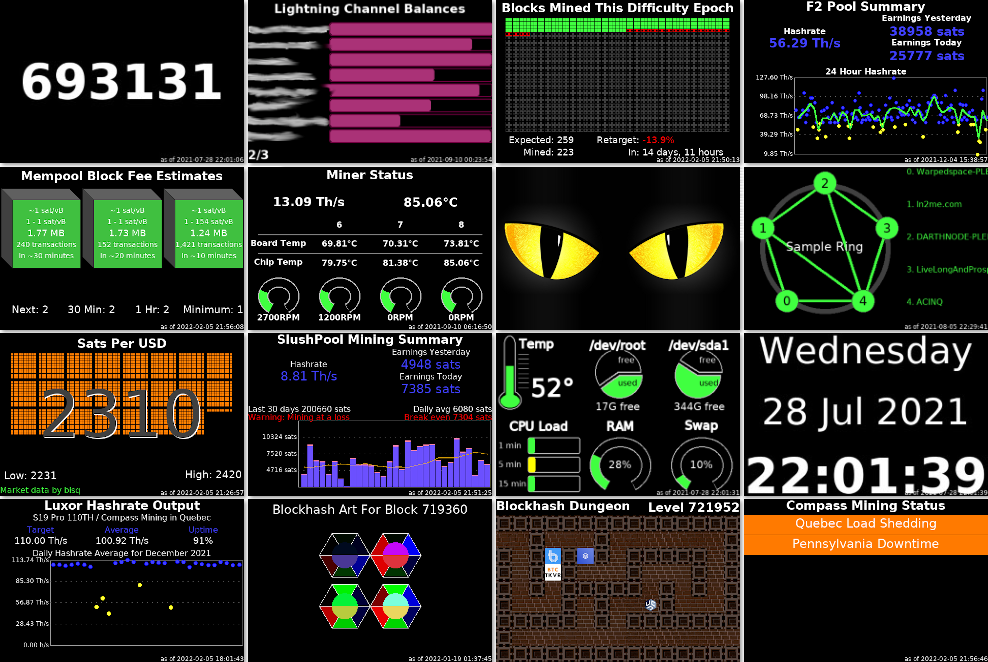

## Quick Menu of Info Panels

- [art hash dungeon](#arthashdungeonpy)
- [block height](#blockheightpy)
- [channel balance](#channelbalancepy)
- [compass mining status](#compassminingstatuspy)
- [difficulty epoch](#difficultyepochpy)
- [f2 pool](#f2poolpy)
- [ip address](#ipaddresspy)
- [luxor pool](#luxor-mining-hashratepy)
- [mempool blocks](#mempoolblockspy)
- [miner status](#minerstatuspy)
- [raretoshi](#raretoshipy)
- [ring of fire](#rofstatuspy)
- [sats per usd](#satsperusdpy)
- [slushpool](#slushpoolpy)
- [system info](#sysinfopy)
- [utc clock](#utcclockpy)

You can also [run as services at startup](#run-at-startup)

## Pre-requisites

To use the scripts in this project, you'll need a Bitcoin Node.  An easy low cost option is a Raspberry Pi based node. Consider following the helpful guidance at [node.guide](https://node.guide) on different nodes available.  Personally I like [Stadicus Raspibolt](https://github.com/Stadicus/RaspiBolt) and [MyNodeBTC](https://github.com/mynodebtc/mynode), but nearly any Raspberry Pi based node should be sufficient provided you have access to the GPIO pins.

You'll also need to ensure dependencies are met for Python and assorted libraries

### Setting up Python, Git, and Torify

1. Login to your node via SSH as admin
2. Install Python3.  The Raspberry Pi comes with Python 2.7, but the scripts asume Python 3. Use the command `sudo apt-get install python3`.
3. Install the Python Pillow library. These scripts were created with the newer Pillow library, but may work with PIL as well. Its my understanding that you can't install both. So its worth doing a check before installing.  

Install dependencies needed for newer versions of Pillow
   ```sh
   sudo apt-get install libjpeg-dev zlib1g-dev
   ```

See if pil or pillow is installed `pip list | grep --ignore-case pi`. Sample output:
   ```sh
   googleapis-common-protos 1.52.0
   Pillow                   8.3.1
   pip                      21.2.1
   pipenv                   2020.6.2
   RPi.GPIO                 0.7.0
   typing-extensions        3.7.4.2
   ```
If neither PIL or Pillow is installed, then go ahead with `pip install Pillow`. 

You can upgrade Pillow to the latest using `python3 -m pip install --upgrade Pillow`

Some scripts make use of rounded_rectangle, which requires Pillow 8.2 or above.

4. Install Beautiful Soup python library using the command `python3 -m pip install beautifulsoup4`
5. Install git using the command `sudo apt install git`. This will get used later to clone the repo.
6. Install torify using the command `sudo apt-get install apt-transport-tor`. This may be used when calling external services like Bisq or Mempool.space to improve privacy.
7. Install pandas using the command `python3 -m pip install pandas`. This is used by the luxor related scripts

### Prepare output folder and clone repository

The assorted python scripts each create image files.  We want them all in a single folder under the bitcoin user.

1. Login to your node via SSH as admin if you have not already done so
2. Change to the bitcoin user `sudo su - bitcoin`
3. Create the folder for images `mkdir /home/bitcoin/images`
4. Clone this repo `cd /home/bitcoin ; git clone https://github.com/vicariousdrama/nodeyez.git`
5. Mark the scripts as executable `chmod +x ~/nodeyez/scripts/*`
6. Create folders for configuration files `mkdir -p ~/nodeyez/config`
7. Create folders for data files `mkdir -p ~/nodeyez/data`
8. Exit the shell from the bitcoin user, returning to admin `exit`


### Display to a screen attached to GPIO

If you are using a Raspberry Pi, you can acquire and install a 3.5" TFT screen to display the images created. The resolution is 480x320 and should be based on the XPT2046 chip.  The one I've used I got from a local electronics store.  It looks like this and generally costs between $15 and $30. You can get one from [amazon here](https://amzn.to/3f7QbgJ)


**To setup the screen**

1. Login to your pi, and do `sudo raspi-config` (menu 3 Interface Options / P4 SPI). Save and exit.
2. Edit the /boot/config.txt via `sudo nano /boot/config.txt`.  Verify that it has a line reading `dtpararm=spi=on`.  You'll need to add a line at the bottom of the file for the screen as `dtoverlay=piscreen,speed=16000000,rotate=270`.  The 270 rotation is a landscape mode with the ports for USB and ethernet to the right.  All images created by the scripts are in landscape mode, so you're rotation should be either 90 or 270 depending on preferred orientation.  Save (CTRL+O) and Exit (CTRL+X).
3. Next, install the framebuffer image viewer using the command `sudo apt-get install fbi`. 
4. Reboot. You'll need to reboot before the changes for boot and the GPIO pins are enabled for the screen.  Do a safe shutdown. If you're running a node package like MyNodeBTC, then use the console to power cycle the device cleanly.  Use the command `sudo init 6`.

### Displaying to a Website Dashboard

Whether you are using a Raspberry Pi or not, you can also display the images via website dashboard.  You can prepare that by setting up [nginx](./nginx.md).  The dashboard view will automatically cycle through the same images at 10 second intervals, showing smaller versions at the top of the screen.  Clicking on an image will automatically advance the view to the full size version of that one.

## Available scripts

You don't have to run all the scripts contained within.  Pick and choose the ones you like, 
configure and test them out.  Whichever ones you run will output to the common images folder 
to be displayed on an attached screen or website dashboard.

Before running any of the scripts, you are strongly encouraged to review them.  Most are
fairly straight forward, but if you have questions about what a part of the code is doing,
feel free to ask by opening an issue on github.

Scripts should be run as the `bitcoin` user. This is essential for permissions to access
information from the Bitcoin node, Lightning service, and permissions for config files.
There is no need to run the scripts as root, other than the slideshow script for video 
group access.


### arthash.py
This python script produces artwork deterministically based on Bitcoin Blockhash values.

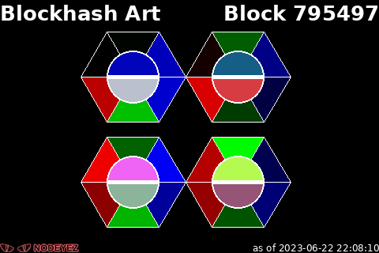

Dependencies:
- A bitcoin node running locally and fully synched
- bitcoin-cli tool available with appropriate macaroons granted to the user running the script
  - calls "getblockchaininfo", "getblockhash"

You may override default configuration by copying the nodeyez/sample-config/arthash.json to nodeyez/config/arthash.json
The configuration allows setting text and outline colors and interval settings.

Run it `python3 scripts/arthash.py`

Press CTRL+C to stop the process to make any changes.  An image will be output to /home/bitcoin/images by default.


### arthashdungeon.py
This python script will query the local bitcoin node using bitcoin-cli and prepare an 
image representing the block hash

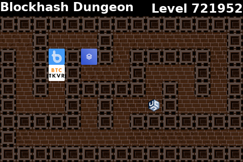

Dependencies:
- A bitcoin node running locally and fully synched
- bitcoin-cli tool available with appropriate macaroons granted to the user running the script
  - calls "getblockchaininfo", "getblockhash"

You may override default configuration by copying the nodeyez/sample-config/arthashdungeon.json to nodeyez/config/arthashdungeon.json
The configuration allows setting text colors, and path to images used for theme tilesets and logos.

Run it `python3 scripts/arthashdungeon.py`

Press CTRL+C to stop the process to make any changes.  An image will be output to /home/bitcoin/images by default.


### blockheight.py
This python script will query the local bitcoin node using bitcoin-cli and prepare an image representing the block height

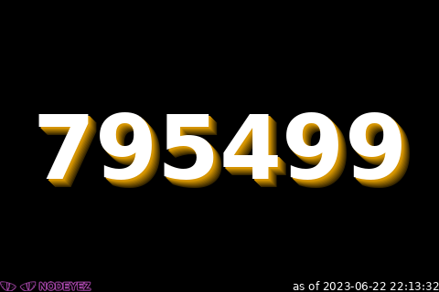

Dependencies:
- A bitcoin node running locally and fully synched
- bitcoin-cli tool available with appropriate macaroons granted to the user running the script
  - calls "getblockchaininfo"

You may override default configuration by copying the nodeyez/sample-config/blockheight.json to nodeyez/config/blockheight.json
The configuration allows setting text colors and sleep timeouts.

Run it `python3 scripts/blockheight.py`

Press CTRL+C to stop the process to make any changes.  An image will be output to /home/bitcoin/images by default.


### channelbalance.py
This python script will create images depicting your nodes lightning channel balances. Multiple images may be created (8 per page), and a bar graph shows relative percentage of the balance on your end or the remote..

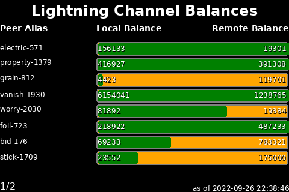

Dependencies:
- A LND lightning node running locally
- lncli tool available with appropriate macaroons granted to the user running the script
  - calls "getnodeinfo", "listchannels"

You may override default configuration by copying the nodeyez/sample-config/channelbalance.json to nodeyez/config/channelbalance.json
The configuration allows setting text colors, bar colors for satoshi balance, and sleep timeouts.

Run it `python3 scripts/channelbalance.py`

Press CTRL+C to stop the process to make any changes.  Images will be output to /home/bitcoin/images by default.


### compassminingstatus.py
This python script will create an image denoting the high level status of facilities 
with Compass Mining as reported on their status page (https://status.compassmining.io).  
This is useful if you have miner(s) hosted with Compass Mining, and need a way to quickly
discern facility status for support purposes.

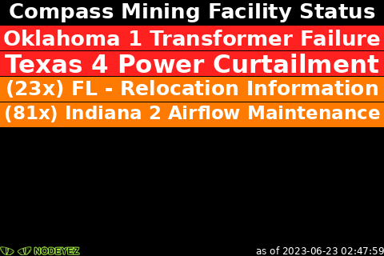

Dependencies:
- Uses Beautiful Soup for parsing (see installation guidance above)
- External calls to https://status.compassmining.io
  - Not using torify

You may override default configuration by copying the nodeyez/sample-config/compassminingstatus.json to nodeyez/config/compassminingstatus.json
The configuration allows setting the status background and text colors, and sleep timeouts.

Run it `python3 scripts/compassminingstatus.py`

Press CTRL+C to stop the process to make any changes.  Images will be output to /home/bitcoin/images by default.


### difficultyepoch.py
This python script will query the local bitcoin node using bitcoin-cli and prepare an image 
representing the number of blocks that have been mined thus far in this difficulty epoch, and 
indicate if ahead of schedule or behind, with an estimated difficulty adjustment to occur when 
the next epoch begins.  A difficulty epoch consists of 2016 blocks.

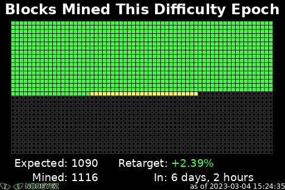

Dependencies:
- A bitcoin node running locally and fully synched
- bitcoin-cli tool available with appropriate macaroons granted to the user running the script
  - calls "getblock", "getblockchaininfo", "getblockhash"

You may override default configuration by copying the nodeyez/sample-config/difficultyepoch.json to nodeyez/config/difficultyepoch.json
The configuration allows setting the text colors and the colors for mined, expected, and blocks
that are ahead or behind, and sleep timeouts.

Run it `python3 scripts/difficultyepoch.py`

Press CTRL+C to stop the process to make any changes.  Images will be output to /home/bitcoin/images by default.


### f2pool.py
This python script is useful if you have a F2 Pool account.  This is based on having a read only account setup.  You'll need your account name.

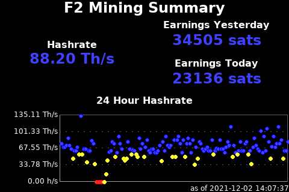

Dependencies:
- An account on F2 Pool
- External calls to https://api.f2pool.com
  - Not using torify

You must override default configuration by copying the nodeyez/sample-config/f2pool.json to nodeyez/config/f2pool.json
at a minimum you will need to specify the account name.
The configuration also allows setting  assorted colors for the graphical charting.

Run it `python3 scripts/f2pool.py`

Press CTRL+C to stop the process to make any changes.  Images will be output to /home/bitcoin/images by default.


### ipaddress.py
This python script will report the current IP addresses of the node.  Values longer than 15 characters 
in length are eliminated, so this should only display IPv4 addresses.

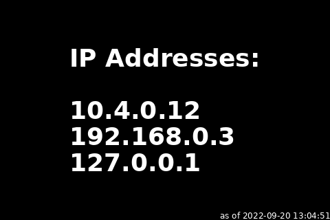

You may override default configuration by copying the nodeyez/sample-config/ipaddress.json to nodeyez/config/ipaddress.json
The configuration allows setting the color for text and the sleep interval

Run it `python3 scripts/ipaddress.py`

Press CTRL+C to stop the process to make any changes.  An image will be output to /home/bitcoin/images by default.


### luxor-mining-hashrate.py
This python script can query the Luxor API to retrieve hashrate history for your account and create images 
for each month of data collected. Currently this script is in beta, and does not run at an interval.  If 
you run it once every month or so, you should be able to keep up to date. See also the daily-data-retrieval.py 
script which retrieves the same information as a service but doesn't produce the images. In time this script 
will be updated to use that common data.

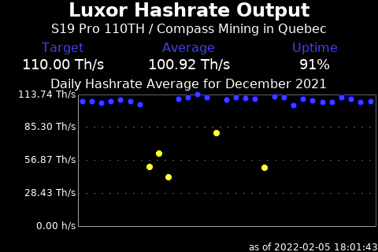

Dependencies:
- An account with Luxor (https://beta.luxor.tech/)
- An API Key with your account
- At time of writing, this script uses a modified version of the Luxor Python Client (https://github.com/LuxorLabs/graphql-python-client)
  - The files (luxor.py and resolvers.py) are already copied into this repo so no additional action is required
  - A Pull Request has been opened with the upstream repository to include the change (forced sort order for the data)
- The Luxor Python client uses Pandas, which needs to be installed once if you haven't yet done so
  - From the scripts folder, run `pip3 install pandas` and wait until it completes
- External calls to https://api.beta.luxor.tech/graphql whenever the script is run. These are not torified

You must override default configuration by copying the nodeyez/sample-config/luxor.json to nodeyez/config/luxor.json
At a minimum you need to specify the apikey and username for your Luxor account.
You can also specify assorted color overrides for the graphical charts produced.

Run it `python3 scripts/luxor-mining-hashrate.py`

This script automatically ends once completed.  Images will be output to /home/bitcoin/images by default.


### mempoolblocks.py
This python script will query the mempool.space service. By default it assumes the usage of 
mempool space viewer from the public [mempool.space](https://mempool.space) website.  If you
have your own MyNodeBTC instance, or another popular node package running mempool service
locally, you can configure that instance instead for more privacy.

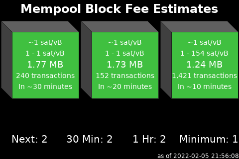

Dependencies:
- A locally running instance of [Mempool](https://github.com/mempool/mempool) or configure script to call external service
- If calling external service https://mempool.space
  - Not using torify

You may override default configuration by copying the nodeyez/sample-config/mempoolblocks.json to nodeyez/config/mempoolblocks.json
The configuration allows setting assorted color settings and the address for the blocks and fee recommendations

Run it `python3 scripts/mempoolblocks.py`

Press CTRL+C to stop the process to make any changes.  An image will be output to /home/bitcoin/images by default.


### minerstatus.py
This python script is useful if you are using a miner running Braiins OS.  This is built with an 
Antminer S9 in mind, so you may need to modify it for your particular miner.


Dependencies:
- A Miner (script only tested on Antminer S9) running [BraiinsOS+](https://braiins.com/os/plus)

You must override default configuration by copying the nodeyez/sample-config/minerstatus.json to nodeyez/config/minerstatus.json
You must set the mineraddress and minerusername. You can optionally override the color settings.

Run it `python3 scripts/minerstatus.py`

Press CTRL+C to stop the process to make any changes.  An image will be output to /home/bitcoin/images by default.


### raretoshi.py
The Raretoshi python script provides for a local rendering of NFTs posted to Raretoshi, with overlays showing the title of the work, author, edition and owner information.
Files downloaded are stored locally as a psuedo IPFS cache to avoid redownloading over and over.  Only PNG and JPEG files are supported at this time.

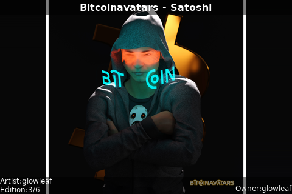

Dependencies:
- External calls to raretoshi.com to get user profile and media metadata
- External calls to ipfs.io to retrieve referenced media

You may override default configuration by copying the nodeyez/sample-config/raretoshi.json to nodeyez/config/raretoshi.json
The configuration allows setting the user collection to generate images from, output location, text colors, and parameters for how the image should scale

Run it `python3 scripts/raretoshi.py`

Press CTRL+C to stop the process to make any changes.  An image will be output to /home/bitcoin/images by default.

### rofstatus.py
The Ring of Fire python script provides renderings of configured Lightning Ring of Fire groups.  
If you have a lightning node and participate in a Ring of Fire, you can configure the pubkeys for each node
in the preordained sequence and the script will provide a useful image showing its present state.  
If channels dont exist on the ring between nodes, then an X will be displayed.  Offline nodes are colored 
red (or whatever configurable color per rofstatus.json) and have rings around them to draw attention.  
Node operator contact list appears to the right of the ring.  You can define as many ring of fire 
configurations as you want in the rofstatus.json, and each can have unique colors, labels, and fonts.
To avoid spamming the lightning network with connection attempts, there is a delay between each ring being processed.

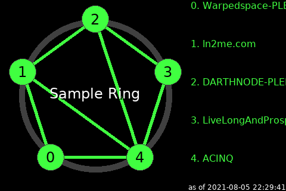

Dependencies:
- A LND lightning node running locally
- lncli tool available with appropriate macaroons granted to the user running the script
  - calls "connect", "disconnect", "getnodeinfo", "listpeers"

A sample configuration may be copied from nodeyez/sample-config/rofstatus.json to nodeyez/config/rofstatus.json
The configuration allows setting one ore more rings, and each with their own settings for ring members and the
colors used.  

Run it `python3 scripts/rofstatus.py`

Press CTRL+C to stop the process to make any changes.  Generated image(s) will be saved to /home/bitcoin/images by default.


### satsperusd.py
This python script calls upon the bisq marketplace to get the current fiat valuation of Bitcoin in 
US Dollar terms, and then calculates the sats per dollar and displays graphically

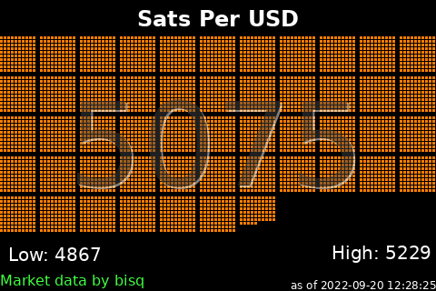

Dependencies:
- External call to https://bisq.markets. 
  - Uses torify

You may override default configuration by copying the nodeyez/sample-config/satsperusd.json to nodeyez/config/satsperusd.json
The configuration allows setting colors, and and some text characteristics for overlay

Run it `python3 scripts/satsperusd.py`

Press CTRL+C to stop the process to make any changes.  An image will be output to /home/bitcoin/images by default.


### slushpool.py
This python script is useful if you have a Slushpool account.  To use it, you'll want to add a profile 
for monitoring with read access. You can do that on the [Access Profiles page](https://slushpool.com/settings/access/).  
The Limited read-only permission is sufficient for the API calls made.

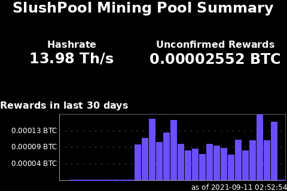

Dependencies:
- An account on Slushpool
- An access token for Slushpool (Limited read-only)
- External calls to https://slushpool.com for "accounts/rewards", "accounts/profile" and "stats" once every 10 minutes.
  - Uses torify
- External call to https://bisq.markets once every 3 hours. 
  - Uses torify

A configuration file must be defined. You can copy the nodeyez/sample-config/slushpool.json to nodeyez/config/slushpool.json
At a minimum you must set the accout information but you may also override the color settings.

Run it `python3 scripts/slushpool.py`

Press CTRL+C to stop the process to make any changes.  An image will be output to /home/bitcoin/images by default.


### sysinfo.py
A useful python script that reports the CPU temperature and load, drive space in use and free, 
as well as memory usage.  Color coding follows green/yellow/red for ranging from all OK to 
heavy usage to warning.

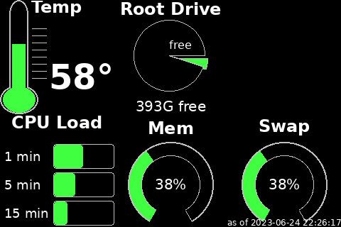

Dependencies:
- Assumes a Raspberry Pi setup using a MicroSD card for the OS (/dev/root), and external storage 
(/dev/sda1) for data files for Bitcoin, LND, etc.

You may override default configuration by copying the nodeyez/sample-config/sysinfo.json to nodeyez/config/sysinfo.json
The configuration allows setting colors.

Run it `python3 scripts/sysinfo.py`

Press CTRL+C to stop the process to make any changes.  An image will be output to /home/bitcoin/images by default.


### utcclock.py
This script provides a simple rendering of the current date and time

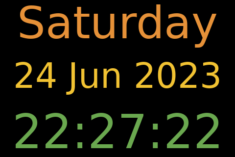

You may override default configuration by copying the nodeyez/sample-config/utcclock.json to nodeyez/config/utcclock.json
The configuration allows setting colors for each of the 3 text fields rendered.

Run it `python3 scripts/utcclock.py`

Press CTRL+C to stop the process to make any changes.  An image will be output to /home/bitcoin/images by default.


## Running the Slideshow

If your node is a Raspberry Pi with the screen attached to GPIO pins, you can now display images to the screen.

The [slideshow.sh](./scripts/slideshow.sh) file is a basic wrapper around the fbi program.  To run it

```
(
cd scripts
chmod +x slideshow.sh
sudo ./slideshow.sh &
)
```

You should start seeing images display on your screen.  If you dont see any images, then edit the slideshow.sh file, and remove the part at the end `> /dev/null 2>&1` and rerun. Any errors should be reported to help diagnose.

## Run At Startup

You can run the scripts you so choose automatically at startup so that you don't have to login and manually start them after a power outage.  To do this, copy the service scripts to the appropriate systemd folder

```sh
sudo cp ~/nodeyez/scripts/systemd/*.service /etc/systemd/system/
```

And enable them

```sh
sudo systemctl enable nodeyez-arthashdungeon.service
sudo systemctl enable nodeyez-blockheight.service
sudo systemctl enable nodeyez-channelbalance.service
sudo systemctl enable nodeyez-compassmining.service
sudo systemctl enable nodeyez-daily-data-retrieval.service
sudo systemctl enable nodeyez-difficultyepoch.service
sudo systemctl enable nodeyez-f2pool.service
sudo systemctl enable nodeyez-ipaddress.service
sudo systemctl enable nodeyez-mempoolblocks.service
sudo systemctl enable nodeyez-minerstatus.service
sudo systemctl enable nodeyez-raretoshi.service
sudo systemctl enable nodeyez-rofstatus.service
sudo systemctl enable nodeyez-satsperusd.service
sudo systemctl enable nodeyez-slideshow.service
sudo systemctl enable nodeyez-slushpool.service
sudo systemctl enable nodeyez-sysinfo.service
sudo systemctl enable nodeyez-utcclock.service
```

And then start them

```sh
sudo systemctl start nodeyez-arthashdungeon.service
sudo systemctl start nodeyez-blockheight.service
sudo systemctl start nodeyez-channelbalance.service
sudo systemctl start nodeyez-compassmining.service
sudo systemctl start nodeyez-daily-data-retrieval.service
sudo systemctl start nodeyez-difficultyepoch.service
sudo systemctl start nodeyez-f2pool.service
sudo systemctl start nodeyez-ipaddress.service
sudo systemctl start nodeyez-mempoolblocks.service
sudo systemctl start nodeyez-minerstatus.service
sudo systemctl start nodeyez-raretoshi.service
sudo systemctl start nodeyez-rofstatus.service
sudo systemctl start nodeyez-satsperusd.service
sudo systemctl start nodeyez-slideshow.service
sudo systemctl start nodeyez-slushpool.service
sudo systemctl start nodeyez-sysinfo.service
sudo systemctl start nodeyez-utcclock.service
```

You can view the logs using journalctl like this

```sh
sudo journalctl -fu nodeyez-sysinfo.service
```

And press CTRL+C to stop viewing the logs
