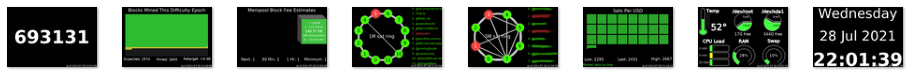

# 
Display panels to get the most from your node

This repository contains simple [scripts](./scripts) that can be run with Python to generate images representing different state about your node.  The images can be easily displayed either on an attached screen using the simple [slideshow.sh](./scripts/slideshow.sh) script or service, or to a [web site dashboard](#displaying-to-a-website-dashboard).

STATUS: ALPHA.  Scripts are functional, may require adjustment (admin vs bitcoin user).  There may be bugs, or unhandled exceptions may be raised that cause related wrapper service to terminate.  Please test and provide feedback.



## Quick Menu of Info Panels

- [block height](#blockheightpy)
- [channel balance](#channelbalancepy)
- [difficulty epoch](#difficultyepochpy)
- [ip address](#ipaddresspy)
- [mempool blocks](#mempool-blockspy)
- [miner status](#minerstatuspy)
- [ring of fire](#rofstatuspy)
- [sats per usd](#satsperusdpy)
- [slushpool](#slushpoolpy)
- [system info](#sysinfopy)
- [utc clock](#utcclockpy)

You can also [run as services at startup](#run-at-startup)

## Pre-requisites

To use the scripts in this project, you'll need a Bitcoin Node.  An easy low cost option is a Raspberry Pi based node. Consider following the helpful guidance at [node.guide](https://node.guide) on different nodes available.  Personally I like [Stadicus Raspibolt](https://github.com/Stadicus/RaspiBolt) and [MyNodeBTC](https://github.com/mynodebtc/mynode), but nearly any Raspberry Pi based node should be sufficient provided you have access to the GPIO pins.

You'll also need to ensure dependencies are met for Python and assorted libraries

### Setting up Python, Git and Torify

1. Login to your node via SSH as admin
2. Install Python3.  The Raspberry Pi comes with Python 2.7, but the scripts asume Python 3. Use the command `sudo apt-get install python3`.
3. Install the Python Pillow library. These scripts were created with the newer Pillow library, but may work with PIL as well. Its my understanding that you can't install both. So its worth doing a check before installing.  
 
See if pil or pillow is installed `pip list | grep --ignore-case pi`. Sample output:
   ```sh
   googleapis-common-protos 1.52.0
   Pillow                   8.3.1
   pip                      21.2.1
   pipenv                   2020.6.2
   RPi.GPIO                 0.7.0
   typing-extensions        3.7.4.2
   ```
If neither PIL or Pillow is installed, then go ahead with `pip install Pillow`. 

You can upgrade Pillow to the latest using `python3 -m pip install --upgrade Pillow`

4. Install git using the command `sudo apt install git`. This will get used later to clone the repo.
5. Install torify using the command `sudo apt-get install apt-transport-tor`. This may be used when calling external services like Bisq or Mempool.space to improve privacy.

### Prepare output folder and clone repository

The assorted python scripts each create image files.  We want them all in a single folder under the bitcoin user.

1. Login to your node via SSH as admin if you have not already done so
2. Change to the bitcoin user `sudo su - bitcoin`
3. Create the folder for images `mkdir /home/bitcoin/images`
4. Clone this repo `cd /home/bitcoin ; git clone https://github.com/vicariousdrama/nodeyez.git`
5. Mark the scripts as executable `chmod +x ~/nodeyez/scripts/*`
6. Exit the shell from the bitcoin user, returning to admin `exit`


### Display to a screen attached to GPIO

If you are using a Raspberry Pi, you can acquire and install a 3.5" TFT screen to display the images created. The resolution is 480x320 and should be based on the XPT2046 chip.  The one I've used I got from a local electronics store.  It looks like this and generally costs between $15 and $30. You can get one from [amazon here](https://amzn.to/3f7QbgJ)


**To setup the screen**

1. Login to your pi, and do `sudo raspi-config` (menu 3 Interface Options / P4 SPI). Save and exit.
2. Edit the /boot/config.txt via `sudo nano /boot/config.txt`.  Verify that it has a line reading `dtpararm=spi=on`.  You'll need to add a line at the bottom of the file for the screen as `dtoverlay=piscreen,speed=16000000,rotate=270`.  The 270 rotation is a landscape mode with the ports for USB and ethernet to the right.  All images created by the scripts are in landscape mode, so you're rotation should be either 90 or 270 depending on preferred orientation.  Save (CTRL+O) and Exit (CTRL+X).
3. Next, install the framebuffer image viewer using the command `sudo apt-get install fbi`. 
4. Reboot. You'll need to reboot before the changes for boot and the GPIO pins are enabled for the screen.  Do a safe shutdown. If you're running a node package like MyNodeBTC, then use the console to power cycle the device cleanly.  Use the command `sudo init 6`.

### Displaying to a Website Dashboard

Whether you are using a Raspberry Pi or not, you can also display the images via website dashboard.  You can prepare that by setting up [nginx](./nginx.md).  The dashboard view will automatically cycle through the same images at 10 second intervals, showing smaller versions at the top of the screen.  Clicking on an image will automatically advance the view to the full size version of that one.

## Available scripts

You don't have to run all the scripts contained within.  Pick and choose the ones you like, configure and test them out.  Whichever ones you run will output to the common images folder to be displayed on an attached screen or website dashboard.

### blockheight.py
This python script will query the local bitcoin node using bitcoin-cli and prepare an image representing the block height


Dependencies:
- A bitcoin node running locally and fully synched
- bitcoin-cli tool available with appropriate macaroons granted to the user running the script
  - calls "getblockchaininfo"

Before running the script, edit it to make changes
```
nano scripts/blockheight.py
```
You may want to change the location of the outputFile.
If you want to adjust the frequency, alter the sleeptime parameter near the bottom of the script (default 2 minutes).
Save (CTRL+O) and Exit (CTRL+X).

Run it `python3 scripts/blockheight.py`

Press CTRL+C to stop the process to make any changes.  An image will be output to /home/bitcoin/images by default.

### channelbalance.py
This python script will create images depicting your nodes lightning channel balances. Multiple images may be created (8 per page), and a bar graph shows relative percentage of the balance on your end or the remote..


Dependencies:
- A LND lightning node running locally
- lncli tool available with appropriate macaroons granted to the user running the script
  - calls "getnodeinfo", "listchannels"

Before running the script, edit it to make changes
```
nano scripts/channelbalance.py
```
You may want to change the location of the outputFile.  
If you want to adjust the frequency, alter the sleeptime parameter near the bottom of the script (default 30 minutes).
Save (CTRL+O) and Exit (CTRL+X).

Run it `python3 scripts/channelbalance.py`

Press CTRL+C to stop the process to make any changes.  If you're node has channels, then one or more images will be output to /home/bitcoin/images by default.

### difficultyepoch.py
This python script will query the local bitcoin node using bitcoin-cli and prepare an image representing the number of blocks that have been mined thus far in this difficulty epoch, and indicate if ahead of schedule or behind, with an estimated difficulty adjustment to occur when the next epoch begins.  A difficulty epoch consists of 2016 blocks.


Dependencies:
- A bitcoin node running locally and fully synched
- bitcoin-cli tool available with appropriate macaroons granted to the user running the script
  - calls "getblock", "getblockchaininfo", "getblockhash"

Before running the script, edit it to make changes
```
nano scripts/difficultyepoch.py
```
You may want to change the location of the outputFile.  You can also alter the colors of mined and expected blocks, etc if you so desire.
If you want to adjust the frequency, alter the sleeptime parameter near the bottom of the script (default 10 minutes).
Save (CTRL+O) and Exit (CTRL+X).

Run it `python3 scripts/difficultyepoch.py`

Press CTRL+C to stop the process to make any changes.  An image will be output to /home/bitcoin/images by default.

### ipaddress.py
This python script will report the current IP addresses of the node.  Values longer than 15 characters in length are eliminated, so this should only display IPv4 addresses.


Before running the script, edit it to make changes
```
nano scripts/ipaddress.py
```
You may want to change the location of the outputFile.  
If you want to adjust the frequency, alter the sleeptime parameter near the bottom of the script (default 5 minutes).
Save (CTRL+O) and Exit (CTRL+X).

Run it `python3 scripts/ipaddress.py`

Press CTRL+C to stop the process to make any changes.  An image will be output to /home/bitcoin/images by default.

### mempool-blocks.py
This python script will query the mempool.space service. By default it assumes the usage of mempool space viewer on a local MyNodeBTC instance, but the script can be altered to use the public [mempool.space](https://mempool.space) website.  It will display up to 3 upcoming blocks in a similar way as mempool space website renders.


Dependencies:
- A locally running instance of [Mempool](https://github.com/mempool/mempool) or configure script to call external service
- If calling external service https://mempool.space
  - Not using torify

Before running the script, edit it to make changes
```
nano scripts/mempool-blocks.py
```
You may want to change the location of the outputFile.  
If you have mempool viewer running locally, but a different location/port, then update urlmempool and urlfeerecs.
If you dont have mempool viewer running locally, you can use the mempool.space website by commenting the existing values, and uncommenting the ones for mempool.space
If you want to adjust the frequency, alter the sleeptime parameter near the bottom of the script (default 5 minutes).
Save (CTRL+O) and Exit (CTRL+X).

Run it `python3 scripts/mempool-blocks.py`

Press CTRL+C to stop the process to make any changes.  An image will be output to /home/bitcoin/images by default.

### minerstatus.py
This python script is useful if you are using a miner running Braiins OS.  This is built with an Antminer S9 in mind, so you may need to modify it for your particular miner.


Dependencies:
- A Miner (script only tested on Antminer S9) running [BraiinsOS+](https://braiins.com/os/plus)
 
Before running the script, you should review it
```
nano scripts/minerstatus.py
```
You may want to change the location of the outputFile.
You most definitely should change the mineraddress. Usually this should be an internal IP.
Currently there is no authentication implemented, and it assumes root without a password.
If you want to adjust the frequency, alter the sleeptime parameter near the bottom of the script (default 30 seconds).
Save (CTRL+O) and Exit (CTRL+X).

Run it `python3 scripts/minerstatus.py`

Press CTRL+C to stop the process to make any changes.  An image will be output to /home/bitcoin/images by default.

### rofstatus.py
The Ring of Fire python script provides renderings of configured Lightning Ring of Fire groups.  If you have a lightning node and participate in a Ring of Fire, you can configure the pubkeys for each node in the preordained sequence and the script will provide a useful image showing its present state.  If channels dont exist on the ring between nodes, then an X will be displayed.  Offline nodes are colored red (or whatever configurable color per rofstatus.json) and have rings around them to draw attention.  Node operator contact list appears to the right of the ring.  You can define as many ring of fire configurations as you want in the rofstatus.json, and each can have unique colors, labels, and fonts.


Dependencies:
- A LND lightning node running locally
- lncli tool available with appropriate macaroons granted to the user running the script
  - calls "connect", "disconnect", "getnodeinfo", "listpeers"

Before running the script, you should review it
```
nano scripts/rofstatus.py
```
This script relies on lncli, and gets its configuration from `rofstatus.json`.  When done reviewing, exit the file (CTRL+X)

Now edit the rofstatus.json
```
nano scripts/rofstatus.json
```
You can adjust the frequency (default 900 seconds/15 minutes) if desired, but 15 minutes is actually quite aggressive. In general, no major changes to ring status should be transpiring this often, and its more helpful when diagnosing member outages.
For each ring you are a member of, or what to monitor, collect the public keys for the nodes, the order they appear in, and some means to refer to the operator for convenience (twitter handles or emails are fine).
In the `rings` array, an object has fields for `name`, `imagefilename`, `imagesettings`, and `nodes`.  The name is what appears as text in the middle of the ring when the graphic is created. The imagefilename is where to save the file to.  Each ring defined in the configuration file should get its own filename as it is overwritten each time.  The imagesettings allow fine tuning the colors, fonts and text sies.  With the public keys for nodes and operator information, provide a node object in the nested array.
Save (CTRL+O) and Exit (CTRL+X).

Run it `cd scripts ; python3 rofstatus.py`

Press CTRL+C to stop the process to make any changes.  Depending on the number of rings defined, and how long the script was allowed to run, one or more images will be output to  /home/bitcoin/images by default.  To avoid spamming the lightning network with connection attempts, there is a delay between each ring being processed.

### satsperusd.py
This python script calls upon the bisq marketplace to get the current fiat valuation of Bitcoin in US Dollar terms, and then calculates the sats per dollar and displays graphically


Dependencies:
- External call to https://bisq.markets. 
  - Uses torify

Before running the script, edit it to make changes
```
nano scripts/satsperusd.py
```
You may want to change the location of the outputFile.  You can also alter the colors representing each sat if you so desire.
If you want to adjust the frequency, alter the sleeptime parameter near the bottom of the script (default 1 hour). This calls out to the bisq marketplace data, so an hour is likely sufficient.  It does report the low and high for the past day which gives you a nice range of current valuation.
Save (CTRL+O) and Exit (CTRL+X).

Run it `python3 scripts/satsperusd.py`

Press CTRL+C to stop the process to make any changes.  An image will be output to /home/bitcoin/images by default.

### slushpool.py
This python script is useful if you have a Slushpool account.  To use it, you'll want to add a profile for monitoring with read access. You can do that on the [Access Profiles page](https://slushpool.com/settings/access/).  The Limited read-only permission is sufficient for the API calls made.


Dependencies:
- An account on Slushpool
- An access token for Slushpool (Limited read-only)
- External calls to https://slushpool.com for "accounts/rewards" and "accounts/profile"
  - Not using torify

Before running the script, you should review it
```
nano scripts/slushpool.py
```
You may want to change the location of the outputFile.
You most definitely should change the authtoken.
If you want to adjust the frequency, alter the sleeptime parameter near the bottom of the script (default 5 minutes).  There is an intentional delay between making API calls to avoid spamming the pool.
Save (CTRL+O) and Exit (CTRL+X).

Run it `python3 scripts/slushpool.py`

Press CTRL+C to stop the process to make any changes.  An image will be output to /home/bitcoin/images by default.

### sysinfo.py
A useful python script that reports the CPU temperature and load, drive space in use and free, as well as memory usage.  Color coding follows green/yellow/red for ranging from all OK to heavy usage to warning.


Dependencies:
- Assumes a Raspberry Pi setup using a MicroSD card for the OS (/dev/root), and external storage (/dev/sda1) for data files for Bitcoin, LND, etc.

Before running the script, edit it to make changes
```
nano scripts/sysinfo.py
```
You may want to change the location of the outputFile.  
This script assumes you have a microsd card as the boot drive, and an external drive, like an SSD attached for the main drive.
If your configuration is different you may need to adjust the drive devices referenced on 109,118 and 206,207
If you want to adjust the frequency, alter the sleeptime parameter near the bottom of the script (default 30 seconds).
Save (CTRL+O) and Exit (CTRL+X).

Run it `python3 scripts/sysinfo.py`

Press CTRL+C to stop the process to make any changes.  An image will be output to /home/bitcoin/images by default.

### utcclock.py
This script provides a simple rendering of the current date and time


Before running the script, edit it to make changes
```
nano scripts/utcclock.py
```
You may want to change the location of the outputFile.
Save (CTRL+O) and Exit (CTRL+X).

Run it `python3 scripts/utcclock.py`

Press CTRL+C to stop the process to make any changes.  An image will be output to /home/bitcoin/images by default.

## Running the Slideshow

If your node is a Raspberry Pi with the screen attached to GPIO pins, you can now display images to the screen.

The [slideshow.sh](./scripts/slideshow.sh) file is a basic wrapper around the fbi program.  To run it

```
(
cd scripts
chmod +x slideshow.sh
sudo ./slideshow.sh &
)
```

You should start seeing images display on your screen.  If you dont see any images, then edit the slideshow.sh file, and remove the part at the end `> /dev/null 2>&1` and rerun. Any errors should be reported to help diagnose.


## Run At Startup

You can run the scripts you so choose automatically at startup so that you don't have to login and manually start them after a power outage.  To do this, copy the service scripts to the appropriate systemd folder

```sh
sudo cp ~/nodeyez/scripts/systemd/*.service /etc/systemd/system/
```

And enable them

```sh
sudo systemctl enable nodeyez-blockheight.service
sudo systemctl enable nodeyez-channelbalance.service
sudo systemctl enable nodeyez-difficultyepoch.service
sudo systemctl enable nodeyez-ipaddress.service
sudo systemctl enable nodeyez-mempoolblocks.service
sudo systemctl enable nodeyez-minerstatus.service
sudo systemctl enable nodeyez-rofstatus.service
sudo systemctl enable nodeyez-satsperusd.service
sudo systemctl enable nodeyez-slideshow.service
sudo systemctl enable nodeyez-slushpool.service
sudo systemctl enable nodeyez-sysinfo.service
sudo systemctl enable nodeyez-utcclock.service
```

And then start them

```sh
sudo systemctl start nodeyez-blockheight.service
sudo systemctl start nodeyez-channelbalance.service
sudo systemctl start nodeyez-difficultyepoch.service
sudo systemctl start nodeyez-ipaddress.service
sudo systemctl start nodeyez-mempoolblocks.service
sudo systemctl start nodeyez-minerstatus.service
sudo systemctl start nodeyez-rofstatus.service
sudo systemctl start nodeyez-satsperusd.service
sudo systemctl start nodeyez-slideshow.service
sudo systemctl start nodeyez-slushpool.service
sudo systemctl start nodeyez-sysinfo.service
sudo systemctl start nodeyez-utcclock.service
```

You can view the logs using journalctl like this

```sh
sudo journalctl -fu nodeyez-sysinfo.service
```

And press CTRL+C to stop viewing the logs
