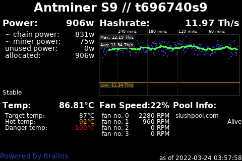

# About Nodeyez

Nodeyez is a project that contains a variety of python [scripts](./scripts) to
produce images based on your Bitcoin Node

Images can be displayed to video output such as an attached screen on a
Raspberry Pi, as well as to a website dashboard for browser based access. In
addition, some scripts have support for reporting data to a local
[Blockclock Mini](https://blockclockmini.com/).

Scripts can be run on their own, or run continuously in the background as a service on system startup.

# Images

A few sample images that you can produce on your node using Nodeyez are shown below

## Informational Panels

* [IP Address](./_docs/script-ipaddress.md)
* [System Metrics](./_docs/script-sysinfo.md)
* [UTC Clock](./_docs/script-utcclock.md)

## Bitcoin Panels

All of these panels can work with a local Bitcoin node. At this time, information is accessed via bitcoin-cli RPC calls.

* [Art Hash](./_docs/script-arthash.md)
* [Blockhash Dungeon](./_docs/script-arthashdungeon.md)
* [Block Height](./_docs/script-blockheight.md)
* [Block Stats](./_docs/script-blockstats.md)
* [Difficulty Epoch](./_docs/script-difficultyepoch.md)
* [Halving Countdown](./_docs/script-halving.md)
* [Inscription Mempool](./_docs/script-inscriptionmempool.md)
* [Mempool Blocks](./_docs/script-mempoolblocks.md)
* [OP_RETURN](./_docs/script-opreturn.md)
* [Ordinal Inscriptions](./_docs/script-ordinals.md)

## Lighting (LND) Panels

These panels can be configured to report on local LND based nodes, as well as remote ones over REST.

* [Channel Balance](./_docs/script-channelbalance.md)
* [Channel Fees](./_docs/script-channelfees.md)
* [LND Hub Account Balances](./_docs/script-lndhub.md)
* [Ring of Fire](./_docs/script-rofstatus.md)

## Mining Panels

* [F2 Pool](./_docs/script-f2pool.md)
* [Luxor Pool](./_docs/script-luxor-mining-hashrate.md)
* [Miner - Braiins](./_docs/script-minerbraiins.md)
* [Miner - MicroBT](./_docs/script-minermicrobt.md)
* [Braiins Pool](./_docs/script-braiinspool.md)

## Other Fun Panels

* [Dual Image Display](./_docs/script-nodeyezdual.md)
* [Fear and Greed Index](./_docs/script-fearandgreed.md)
* [Price of Bitcoin](./_docs/script-fiatprice.md)
* [Sats per USD](./_docs/script-satsperusd.md)
* [Whirlpool CLI Mix Status](./_docs/script-whirlpoolclimix.md)
* [Whirlpool Liquidity](./_docs/script-whirlpoolliquidity.md)

## No Longer Supported

The scripts are still available, but may not properly function as the data providers have changed from open standards or charge exhorbitant fees.

* [Compass Mining Hardware](./_docs/script-compassmininghardware.md)
* [Compass Mining Status](./_docs/script-compassminingstatus.md)
* [Gas Price](./_docs/script-gasprice.md)
* [Raretoshi](./_docs/script-raretoshi.md)

# Installation Procedures

1. [Your Node](./_install_steps/1yournode.md)
2. [Display Screen](./_install_steps/2displayscreen.md)
3. [Python and Dependencies](./_install_steps/3pythondeps.md)
4. [Nodeyez User Setup](./_install_steps/4nodeyez.md)
5. [Panel Selection](./_install_steps/5panels.md)
6. [Slideshow Config](./_install_steps/6slideshow.md)
7. [Website Dashboard](./_install_steps/7websitedashboard.md)
8. [Running at Startup](./_install_steps/8runatstartup.md)

