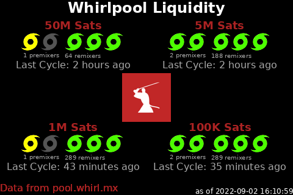

# About Nodeyez

Nodeyez is a project that contains a variety of python [scripts](./scripts) to
produce images based on your Bitcoin Node

Images can be displayed to video output such as an attached screen on a
Raspberry Pi, as well as to a website dashboard for browser based access. In
addition, some scripts have support for reporting data to a local
[Blockclock Mini](https://blockclockmini.com/).

Scripts can be run on their own, or run continuously in the background as a service on system startup.

# Images

A few sample images that you can produce on your node using Nodeyez are shown below

## Informational Panels

* [IP Addresses](./_docs/script-ipaddresses.md)
* [System Metrics](./_docs/script-sysinfo.md)
* [UTC Clock](./_docs/script-utcclock.md)

## Bitcoin Panels

All of these panels can work with a local Bitcoin node. At this time, information is accessed via bitcoin-cli RPC calls.

* [Art Hash](./_docs/script-arthash.md)
* [Blockhash Dungeon](./_docs/script-blockhashdungeon.md)
* [Block Height](./_docs/script-blockheight.md)
* [Block Stats](./_docs/script-blockstats.md)
* [Difficulty Epoch](./_docs/script-difficultyepoch.md)
* [Halving Countdown](./_docs/script-halving.md)
* [Inscription Mempool](./_docs/script-inscriptionmempool.md)
* [Inscription Parser](./_docs/script-inscriptionparser.md)
* [Mempool Space](./_docs/script-mempoolspace.md)
* [OP_RETURN](./_docs/script-opreturn.md)

## Lighting (LND) Panels

These panels can be configured to report on local LND based nodes, as well as remote ones over REST.

* [LND Channel Balance](./_docs/script-lndchannelbalance.md)
* [LND Channel Fees](./_docs/script-lndchannelfees.md)
* [LND Hub Account Balances](./_docs/script-lndhub.md)
* [LND Ring of Fire](./_docs/script-lndringoffire.md)

## Mining Panels

* [Miner Status](./_docs/script-miner.md)
* [Braiins Pool](./_docs/script-miningpool-braiinspool.md)
* [F2 Pool](./_docs/script-miningpool-f2pool.md)
* [Luxor Pool](./_docs/script-miningpool-luxorpool.md)

## Nostr Panels

* [Nostr.Band Stats](./_docs/script-nostrbandstats.md)

## Other Fun Panels

* [Compass Mining Status](./_docs/script-compassminingstatus.md)
* [Dual Image Display](./_docs/script-nodeyezdual.md)
* [Fear and Greed Index](./_docs/script-fearandgreed.md)
* [Price of Bitcoin](./_docs/script-fiatprice.md)
* [Raretoshi](./_docs/script-raretoshi.md)
* [Sats per Fiat Unit](./_docs/script-satsperfiatunit.md)
* [Whirlpool CLI Mix Status](./_docs/script-whirlpoolclimix.md)
* [Whirlpool Liquidity](./_docs/script-whirlpoolliquidity.md)

# Installation Procedures

1. [Quick Start Installation](./_install_steps/0quickstart.md) -- Quick fast setup using install script!

2. [General Node Guidance](./_install_steps/1yournode.md)
3. [Display Screen](./_install_steps/2displayscreen.md) -- (optional)
4. [Installing Common Tools](./_install_steps/3tools.md)
5. [Nodeyez User Setup](./_install_steps/4nodeyez.md)
6. [Panel Index](./_install_steps/5panels.md)
7. [Running the Slideshow](./_install_steps/6slideshow.md) -- (optional)
8. [Website Dashboard](./_install_steps/7websitedashboard.md)
9. [Running Nodeyez Services at Startup](./_install_steps/8runatstartup.md)

10. [Nodeyez-Config Tool](./_install_steps/9nodeyezconfig.md) -- NEW! Easy configuration!

# Development Environment

1. [Architecture](./_developer/0architecture.md)
2. [Python and IDE](./_developer/1basicsetup.md)
3. [Run and Change Code](./_developer/2runandchange.md)
4. [Regtest](./_developer/3regtest.md)

