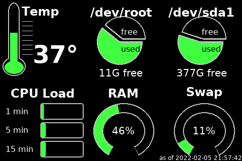

# 
Display panels to get the most from your node

This repository contains simple [scripts](./scripts) used to generate images 
representing different state about your node, market rates, mining and more.

The images can be displayed via simple slideshow to attached screen, or to a
website dashboard.  The installation steps below will guide you through setting
up both options.  Some scripts also have support for reporting data to a local [Blockclock Mini](https://blockclockmini.com/).
For convenience, systemd service scripts are also available to allow for running
them at startup automatically.

## Quick Menu of Info Panels

| Panel Name | Requires Bitcoin Node | Requires Lightning Service | Makes Remote Calls |
| --- | --- | --- | --- |
|                **_Local Only_** |
| [ip address](./docs/script-ipaddress.md) | | | |
| [system info](./docs/script-sysinfo.md) | | | |
| [utc clock](./docs/script-utcclock.md) | | | |
|                **_Bitcoin Dependent_** |
| [art hash](./docs/script-arthash.md) | Yes | | |
| [art hash dungeon](./docs/script-arthashdungeon.md) | Yes | | |
| [block height](./docs/script-blockheight.md) | Yes | | |
| [difficulty epoch](./docs/script-difficultyepoch.md) | Yes | | |
| [halving countdown](./docs/script-halving.md) | Yes | | |
| [mempool blocks](./docs/script-mempoolblocks.md) | | | Optional |
| [op return](./docs/script-opreturn.md) | Yes | | |
| [ordinal inscriptions](./docs/script-ordinals.md) | Yes | | | 
|                **_Lightning Dependent_** |
| [channel balance](./docs/script-channelbalance.md) | | Yes | |
| [channel fees](./docs/script-channelfees.md) | | Yes | |
| [lnd hub account balances](./docs/script-lndhub.md) | | Yes | |
| [ring of fire](./docs/script-rofstatus.md) | | Yes | Yes |
|                **_Mining Related_** |
| [f2 pool](./docs/script-f2pool.md) | | | Yes |
| [luxor pool](./docs/script-luxor-mining-hashrate.md) | | | Yes |
| [miner - braiins](./docs/script-minerbraiins.md) | | | |
| [miner - microbt](./docs/script-minermicrobt.md) | | | |
| [slushpool](./docs/script-slushpool.md) | | | Yes |
|                **_Other Fun Stuff_** |
| [compass mining status](./docs/script-compassminingstatus.md) | | | Yes |
| [dual image display](./docs/script-nodeyezdual.md) | | | Yes |
| [fear and greed index](./docs/script-fearandgreed.md) | | | Yes |
| [price of bitcoin](./docs/script-fiatprice.md) | | | Yes |
| [sats per usd](./docs/script-satsperusd.md) | | | Yes |
| [whirlpool cli mix status](./docs/script-whirlpoolclimix.md) | Yes | | |
| [whirlpool liquidity](./docs/script-whirlpoolliquidity.md) | | | Optional |
|                **_No Longer Supported_** |
|                _The scripts are still available, but may not properly function as the data providers have changed from open standards or charge outrageous fees_ |
| [compass mining hardware](./docs/script-compassmininghardware.md) | | | Yes |
| [gas price](./docs/script-gasprice.md) | | | Yes |
| [raretoshi](./docs/script-raretoshi.md) | | | Yes |

## Installation Steps

1. [Raspberry Pi Node](./docs/install-1-raspberrypinode.md)
2. [Python and Dependencies](./docs/install-2-pythondeps.md)
3. [Display Screen](./docs/install-3-displayscreen.md)
4. [Nodeyez User and this Git Repository](./docs/install-4-nodeyez.md)
5. [Website Dashboard](./docs/install-5-websitedashboard.md)
6. [Running Services at Startup](./docs/install-6-runatstartup.md)

