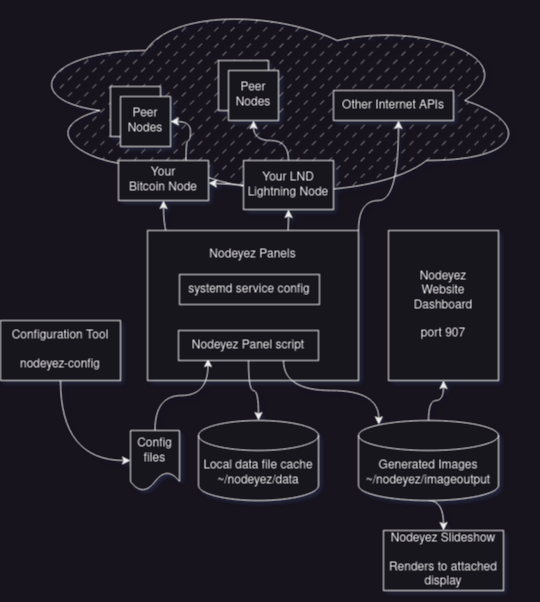

# Architecture

The following depicts how Nodeyez components work together at a high level.



## Nodeyez Panels

Each Nodeyez panel is comprised of the following

- a unique service identifier/name
- service definition file
- panel generation script
- sample configuration files
- documentation

### Service identifier

The unique service identifier name is used to associate the service definition to sample configuration and user configuration files via the nodeyez-config tool desribed below.  It is also correlated to the naming of the panel generation script, which in turn should reference the same configuration files.

Example: `halving`

### Service definition

A service definition file takes the name of "nodeyez-<serviceid>.service" and is a standard systemd type definition file that will be deployed to /etc/systemd/system folder.  Source code to these definitions are in the scripts/systemd folder.

The general structure of service definition scripts is consistent and differences are generally for denoting dependencies such as bitcoin or lightning services.

Example: 

<ul><li><a href="../scripts/systemd/nodeyez-halving.service">~/nodeyez/scripts/systemd/nodeyez-<i><u>halving</u></i>.service</a></li></ul>


### Panel generation script

The bulk of panel logic is in the python script for the service.  These are available in the scripts folder, and thats where any additional scripts should be created.

Panel scripts inherit from the NodeyezPanel class defined in the scripts/vicariouspanel.py source file. This includes common helper functions for preparing the image output.

Example: 

<ul><li><a href="../scripts/halving.py">~/nodeyez/scripts/<i><u>halving</u></i>.py</a></li></ul>

Within the panel generation file, the service identifier is what is used to set the name of the panel when init is called.  For example, around line 50 of the aforementioned halving.py file you'll see this

```python
# Initialize
super().__init__(name="halving")
```

### Configuration files

On initialization, panels read from the configuration files. These scripts look for user defined configuration in the config folder, and fall back to the sample-config folder when missing, or to fill in default attributes not set by the user config.

The [nodeyez-config](../scripts/nodeyez-config) tool is opinionated about the location of configuration files and relies on the sample-config for definitions of fields, data types, descriptions, allowed values and more. It also requires nodeyez to be installed as a user with the config files in /home/nodeyez/nodeyez/config.

Example: 

<ul><li><a href="../config/halving.json">~/nodeyez/config/<i><u>halving</u></i>.json</a></li><li><a href="../sample-config/halving.json">~/nodeyez/sample-config/<i><u>halving</u></i>.json</a></li></ul>

### Documentation

A Nodeyez panel should have accompanying documentation.  Each Nodeyez panel thus far has been documented in the _docs folder in markdown format.

Example:

<ul><li><a href="../_docs/script-halving.md">~/nodeyez/_docs/script-<i><u>halving</u></i>.md</a></li></ul>

## Accessing Resources

Nodeyez panels get data from a variety of resources

- local data cache
- bitcoin node
- lnd lightning node
- internet apis

### Local data cache

A common data directory is available to all panel scripts at [~/nodeyez/data](../data) and subfolders should be created as needed for uniqueness. Some scripts leverage the same data and will share it. For example, multiple scripts refer to the bisq market price data, and the halving script uses images retrieved by the raretoshi script.

### Bitcoin Node

One or more bitcoin nodes can be configured for Nodeyez to access, with one set as the activeProfile to use by default.  The node can be on the same server where Nodeyez is run, or a remote resource on the local network or the internet.  As long as the address is reachable, and rpcuser and rpcpassword are provided and the node is listening for such calls, it doesn't matter where the Bitcoin node is.  This should even facilitate using Nodeyez on an Umbrel node or other node using docker setups, but has not yet been tested.

### Lightning Node

Similar to bitcoin nodes, there may be multiple lightning nodes defined, accessible via REST calls.  Permissions granted in the macaraoon will control whether panels are able to attain the information they need to generate images.  If additional permissions are needed for a new panel, a developer should add the appropriate guidance to the various documentation points and installation scripts.

### Internet APIs

Some of the existing Nodeyez panels retrieve data from websites on the internet. For example, raretoshi assets and images, fear and greed index, the Bisq market price data. Whenever additional APIs are called by a panel, it is encouraged to make the url and in some cases header information configurable in case of changes and support the ability to make the calls over TOR for privacy.

## Nodeyez Website

The website dashboard allows for viewing the images generated by Nodeyez panels in a web browser on PC or mobile device.  The stack leverages nginx, augmenting an existing install if present, or installing nginx if its not yet there.

## Nodeyez Slideshow

A slideshow script can be launched from a service if a screen is connected to the system running Nodeyez.  The slideshow simply displays all images in order that are found in the [~/nodeyez/imageoutput](../imageoutput/) folder with a few seconds delay between each, and then updates its list of images to display with the current directory list when it reaches the end.

---

[Home](../) | [Continue to Python and IDE Setup]()
