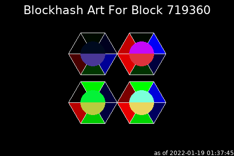

# Art Hash

This script produces geometric artwork deterministically based on Bitcoin
Blockhash values. It depends on a bitcoin node running locally and fully
synched.



## Script Location

The script is installed at 
[~/nodeyez/scripts/arthash.py](../scripts/arthash.py). 

## Configuration

To configure this script, edit the `~/nodeyez/config/arthash.json` file

Fields are defined below

| field name | description |
| --- | --- |
| outputFile | The path to save the generated image. Default `../imageoutput/arthash.png` |
| colorTextFG | The color of the text expressed as a Hexadecimal color specifier. Default `#ffffff` |
| colorShapeOutline | The color of the outline for shapes expressed as a hexadecimal color specifier. Default `#ffffff` |
| colorBackground | The background color of the image expressed as a hexadecimal color specifier. Default `#000000` |
| width | The width, in pixels, to generate the image. Default `480` |
| height | The height, in pixels, to generate the image. Default `320` |
| sleepInterval | The amount of time, in seconds, the script should wait before data gathering and image creation again. Default `300` |

## Run Directly

Ensure the virtual environment is activated
```shell
source ~/.pyenv/nodeyez/bin/activate
```

Change to the scripts folder
```shell
cd ~/nodeyez/scripts
```

And run it
```shell
python arthash.py
```

Press CTRL+C to stop the process

## Run at Startup

To enable the script to run at startup, as the privileged user run the following

```shell
sudo systemctl enable nodeyez-arthash.service

sudo systemctl start nodeyez-arthash.service
```

---

[Home](../) | 