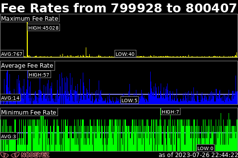
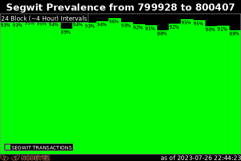

# Block Stats

This script prepares an image displaying stats for the current or specified block height.  
It depends on a bitcoin node running locally and fully synched.


An additional image can be produced to graph fee rates over time



An additional image can be produced to graph segwit prevalence over time



## Script Location

The script is installed at 
[/home/nodeyez/nodeyez/scripts/blockstats.py](../scripts/blockstats.py).

## Configuration

To configure this script override the default configuration as follows

```shell
nano /home/nodeyez/nodeyez/config/blockstats.json
```

| field name | description |
| --- | --- |
| outputFile | The path to save the generated image. Optional additional images use a suffix based on this name. Default `/home/nodeyez/nodeyez/imageoutput/blockstats.png` |
| dataDirectory | The base path for the directory to store saved files. This helps improve performance as a file is used to cache blockstats data. Default `/home/nodeyez/nodeyez/data/` |
| width | The width, in pixels, to generate the image. Default `480` |
| height | The height, in pixels, to generate the image. Default `320` |
| sleepInterval | The amount of time, in seconds, the script should wait before data gathering and image creation again. Default `300` |
| colorTextFG | The color of the text expressed as a Hexadecimal color specifier. Default `#ffffff` |
| colorBackground | The background color of the image expressed as a hexadecimal color specifier. Default `#000000` |
| colorShapeOutline | The color to use for outlining the blockstats image charts. Default `#888888` |
| colorShapeShadow | The color to use for shadow of the blockstats image. Default `#88888888` |
| colorGraphOutline | The color to use for outlining charts and their labels. Default `#888888` |
| colorGraphValue | The color to use for primary value in chart for fee rates. Default `#FF8888` |
| colorGraphAverage | The color to use for the average value line drawn across fee rates. Default `#8888FF` |
| colorBands | An array of colors to use for multi valued charts. Default: <ul><li>#FFFF00</li><li>#0000FF</li><li>#00FF00</li><li>#808000</li><li>#FF0000</li><li>#00FFFF</li><li>#800000</li><li>#808080</li><li>#008000</li><li>#800080</li><li>#FF00FF</li><li>#008080</li></ul> |
| logStatsForRanges | Indicates whether summary stats should be reported to log output. Default: `true` |
| showStatsBlock | Indicates whether the stats block image should be created. Default: `true` |
| showFeeRates | Indicates whether the fee rates image should be created. Default: `true` |
| showSegwitPrevalence | Indicates whether the segwit prevalence image should be created. Default `true` |


After making changes, Save (CTRL+O) and Exit (CTRL+X) nano.

## Running Directly

To run this script

```shell
cd /home/nodeyez/nodeyez/scripts
/usr/bin/env python3 blockstats.py
```

Press CTRL+C to stop the process

## Run at Startup

To enable the script to run at startup, as the privileged user run the following

```shell
sudo systemctl enable nodeyez-blockstats.service
sudo systemctl start nodeyez-blockstats.service
```


---

[Home](../) | 

