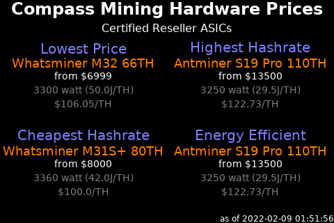

# Compass Mining Hardware

This script creates an image focusing on the lowest priced, highest hashrate,
cheapest hashrate, and efficient hashrate machines currently for sale in the
Compass Mining reseller marketplace.



## Script Location

The script is installed at 
[~/nodeyez/scripts/compassmininghardware.py](../scripts/compassmininghardware.py).

## Configuration

To configure this script, edit the `~/nodeyez/config/compassmininghardware.json` file

Fields are defined below

| field name | description |
| --- | --- |
| outputFile | The path to save the generated image. Default `../imageoutput/compassmininghardware.png` |
| hardwareurl | The url that provides current compass mining hardware prices for featured, reseller, and at home ASICs. Default `https://us-central1-hashr8-compass.cloudfunctions.net/app/hardware/group?isWeb=true&sortByCost=asc` |
| useTor | Indicates whether remote calls should use torify for privacy. Experimental. Default `true` |
| colorTextFG | The color of the text expressed as a Hexadecimal color specifier. Default `#ffffff` |
| colorTextWarn | The color of the text if there are warnings or errors accessing the hardwareurl. Default `#ff0000` |
| colorBackground | The background color of the image expressed as a hexadecimal color specifier. Default `#000000` |
| colorEntryLabel | The color of the group/category label expressed as a Hexadecimal color specifier. Default `#8080ff` |
| colorEntryName | The color of the miner name expressed as a Hexadecimal color specifier. Default `#ff8000` |
| colorEntryPrice | The color of the price expressed as a Hexadecimal color specifier. Default `#ffffff` |
| colorEntryPower | The color of the power info text expressed as a Hexadecimal color specifier". Default `#808080` |
| sizeEntryLabel | The font size to use for the group/category label. Default `20` |
| sizeEntryName | The font size to use for the miner name. Default `18` |
| sizeEntryInfo | The font size to use for the informational labels. Default `14` |
| width | The width, in pixels, to generate the image. Default `480` |
| height | The height, in pixels, to generate the image. Default `320` |
| sleepInterval | The amount of time, in seconds, the script should wait before data gathering and image creation again. Default `3600` |

## Run Directly

Ensure the virtual environment is activated
```shell
source ~/.pyenv/nodeyez/bin/activate
```

Change to the scripts folder
```shell
cd ~/nodeyez/scripts
```

Run it
```shell
python compassmininghardware.py
```

Press CTRL+C to stop the process

## Run at Startup

To enable the script to run at startup, as the privileged user run the following

```shell
sudo systemctl enable nodeyez-compassmininghardware.service

sudo systemctl start nodeyez-compassmininghardware.service
```

---

[Home](../) | 