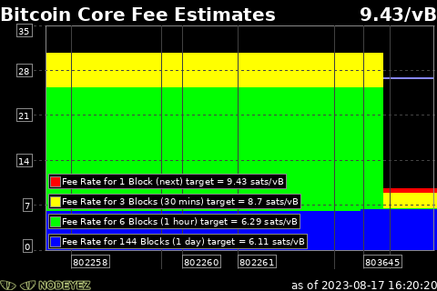

# Fee Estimates

This script prepares an image displaying the estimated fees over time for different confirmation targets.  
It depends on a bitcoin node.



## Script Location

The script is installed at 
[~/nodeyez/scripts/feeestimates.py](../scripts/feeestimates.py).

## Configuration

To manage and configure this script, use the nodeyez-config tool

```sh
sudo nodeyez-config
```

To manually configure this script, edit the `~/nodeyez/config/feeestimates.json` file

Fields are defined below

| field name | description |
| --- | --- |
| backgroundColor | The background color of the image expressed as a hexadecimal color specifier. Default `#000000` |
| graphAverageColor | The color to use for the average value line drawn across fee rates. Default `#8888FF` |
| graphBorderColor | The color to use for outlining charts and their labels. Default `#888888` |
| graphDataColors | An array of colors to use for multi valued charts. Default: `#FF0000`, `#FFFF00`, `#00FF00`, `#0000FF`, `#404040` |
| height | The height, in pixels, to generate the image. Default `320` |
| interval | The amount of time, in seconds, the script should wait before data gathering and image creation again. Default `15` |
| textColor | The color of the text expressed as a Hexadecimal color specifier. Default `#ffffff` |
| width | The width, in pixels, to generate the image. Default `480` |

## Running Directly

Ensure the virtual environment is activated
```shell
source ~/.pyenv/nodeyez/bin/activate
```

Change to the scripts folder
```shell
cd ~/nodeyez/scripts
```

Run it
```shell
python blockstats.py
```

Press CTRL+C to stop the process

## Run at Startup

To enable the script to run at startup, as the privileged user run the following

```shell
sudo systemctl enable nodeyez-blockstats.service

sudo systemctl start nodeyez-blockstats.service
```

---

[Home](../) | 