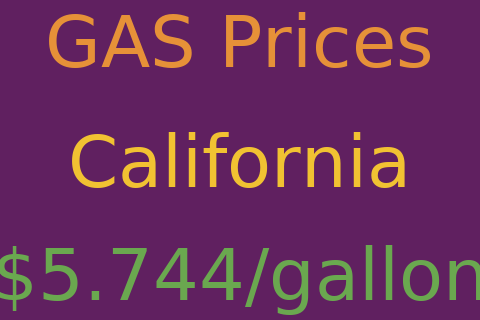

# 
Display panels to get the most from your node

## Gas Price

This script prepares an image displaying the gas price for a state or province in the
United States or Canada.  The script is
installed at [/home/nodeyez/nodeyez/scripts/gasprice.py](../scripts/gasprice.py).
It depends on data being retrieved from [collectapi](./config-collectapi.md) via the
[/home/nodeyez/nodeyez/scripts/daily-data-retrieval.py)(../scripts/daily-data-retrieval.py)
script.



* To run this script

   ```sh
   cd /home/nodeyez/nodeyez/scripts
   /usr/bin/env python3 gasprice.py
   ```

   Press CTRL+C to stop the process

* To configure this script

   Override the default configuration as follows

   ```sh
   nano /home/nodeyez/nodeyez/config/gasprice.json
   ```

   | field name | description |
   | --- | --- |
   | outputFile | The path to save the generated image. Default `/home/nodeyez/nodeyez/imageoutput/gasprice.png` |
   | dataDirectory | The path where data about gas prices have been downloaded to. Default `/home/nodeyez/nodeyez/data/` |
   | dataCountry | The preferred gas price data set to use. Default `USA`. Allowed values: `USA`, `CAN` |
   | dataState | The preferred state or province to look up gas prices for. Default `California`. Allowed values: Any named state or province |
   | randomCountry | Indicates whether the country for gas price data should be chosen randomly. Default `true` |
   | randomState | Indicates whether the state or province for gas price data should be chosen randomly. Default `true` |
   | blockclockEnabled | Indicates whether results should be sent to a blockclock. Default `false` |
   | blockclockAddress | The IP address of the blockclock on your network. Default `21.21.21.21` |
   | blockclockPassword | The password for the blockclock on your network, leave blank for no password. Default is unset |
   | colorTextGas | The color of the main label expressed as a hexadecimal color specifier. Default `#e69138` |
   | colorTextLocation | The color of the location label expressed as a hexadecimal color specifier. Default `#f1c232` |
   | colorTextPrice | The color of the price label expressed as a hexadecimal color specifier. Default `#6aa84f` | 
   | colorBackground | The background color of the image expressed as a hexadecimal color specifier. Default `#602060` |
   | width | The width, in pixels, to generate the image. Default `480` |
   | height | The height, in pixels, to generate the image. Default `320` |
   | sleepInterval | The amount of time, in seconds, the script should wait before data gathering and image creation again. Default `3600` |

   After making changes, Save (CTRL+O) and Exit (CTRL+X) nano.


---

[Home](../README.md) | 

