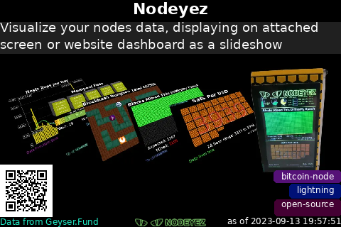

# Geyser Fund

Show info about a randomly chosen project from Geyser.Fund



## Script Location

The script is installed at
[~/nodeyez/scripts/geyserfund.py](../scripts/geyserfund.py).

## Configuration

To manage and configure this script, use the nodeyez-config tool

```sh
sudo nodeyez-config
```

To manually configure this script, edit the `~/nodeyez/config/geyserfund.json` file

Fields are defined below

| field name | description |
| --- | --- |
| backgroundColor | The background color of the image expressed as a hexadecimal color specifier. Default `#000000` |
| height | The height, in pixels, to generate the image. Default `320` |
| interval | The amount of time, in seconds, the script should wait before data gathering and image creation again. Default `300` |
| qrCodeEnabled | Indicates whether to show a QR code to link from the image to the raretoshi website for that item. Dfeault `true` |
| qrCodePixelSize | If qrCodeEnabled is true, then this indicates the qr code box size for each pixel. Default `2` |
| tagRestriction | To restrict images generated to a specific tag or set of tags, specify a value that indicates either the name of the tag, or with a * at the end of the value for tags beginning with the value (e.g. _bitcoin*_). Multiple tags may be specified by including a space between each tag. Default `bitcoin* nostr open-source` To allow any tag, either specify an empty string, or the word `any` or `*`. |
| tagLabelsEnabled | Indicates whether to show all tags associated with the project. Default `true` |
| textColor | The color of the text expressed as a hexadecimal color specifier. Default `#ffffff` | 
| useTor | Indicates whether remote calls should use tor socks proxy for privacy. Default `false`. Note: At time of this panel creation, Tor access was being blocked by Geyser servers |
| width | The width, in pixels, to generate the image. Default `480` |

## Run Directly

Ensure the virtual environment is activated
```shell
source ~/.pyenv/nodeyez/bin/activate
```

Change to the script folder
```shell
cd ~/nodeyez/scripts
```

Run it
```shell
python geyserfund.py
```

Press CTRL+C to stop the process

## Run at Startup

To enable the script to run at startup, as the privileged user run the following

```shell
sudo systemctl enable nodeyez-geyserfund.service

sudo systemctl start nodeyez-geyserfund.service
```

---

[Home](../) | 