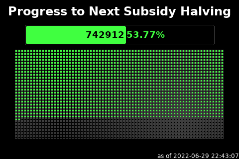

# Halving Countdown

This script will query the local bitcoin node and prepare an image representing
the progress towards the next subsidy halving depicted as a progress bar, and 
each block mined within the current whole number percent.  Since a halving period
is 210000 blocks, each whole percent represents 2100 blocs making for a nice layout.



## Script Location

The script is installed at 
[../scripts/halving.py](../scripts/halving.py).

## Configuration

To configure this script override the default configuration as follows

```shell
nano ../config/halving.json
```

| field name | description |
| --- | --- |
| outputFile | The path to save the generated image. Default `../imageoutput/halving.png` |
| colorTextFG | The color of the text expressed as a Hexadecimal color specifier. Default `#ffffff` |
| colorBackground | The background color of the image expressed as a hexadecimal color specifier. Default `#000000` |
| colorGrid | The base color of the grid representing each block for this period, expressed as a Hexadecimal color specifier. Default `#404040` |
| colorProgress | The color to fill in blocks and draw the progress bar itself, expressed as a Hexadecimal color specifie. Default `#40ff40` |
| gridImageEnabled | Indicates whether to render a graphic image into the grid. If enabled, will source images from the ipfsDirectory location, changing to a different image for each whole percent. Default `True` |
| gridImageUnminedMode | When gridImageEnabled is True, this controls how unmined blocks should appear. Recognized values are 'grayscale', 'dither', 'dither2'.  Unrecognized values will result in full image being displayed in color.  Default `grayscale` |
| ipfsDirectory | A directory to find image files.  This is intended to leverage images downloaded as part of the raretoshi script.  Default `../data/ipfs` |
| fillGridDividersEnabled | This controls whether the lines between individual grid blocks should be filled as well when blocks are produced. Default `true` |
| width | The width, in pixels, to generate the image. Default `480` |
| height | The height, in pixels, to generate the image. Default `320` |
| sleepInterval | The amount of time, in seconds, the script should wait before data gathering and image creation again. Default `540` |

After making changes, Save (CTRL+O) and Exit (CTRL+X) nano.

## Run Directly

* To run this script

```shell
cd ../scripts
/usr/bin/env python3 halving.py
```

Press CTRL+C to stop the process


## Run at Startup

To enable the script to run at startup, as the privileged user run the following

```shell
sudo systemctl enable nodeyez-halving.service
sudo systemctl start nodeyez-halving.service
```

---

[Home](../) | 
