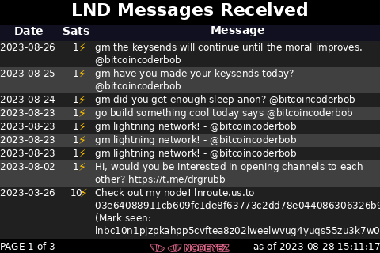

# LND Messages

This script prepares an image depicting messages your node has received via
invoices or keysend payments.  This is initially a basic table listing and will
likely evolve in the future.  Multiple images may be created depending on the
number of messages received.

Multiple lightning nodes may be reported on. These need to be defined as profiles
available to Nodeyez.  To define profiles you'll need the address, the rest port,
and hex of the macaroon file for that node.  The permissions needed in the macaroon
are

- uri:/lnrpc.Lightning/ListInvoices

The following command can be used to convert a macaroon into the necessary hex
format: `xxd -ps -u -c 1000 nodeyez.macaroon`



## Script Location

The script is installed at
[~/nodeyez/scripts/lndmessages.py](../scripts/lndmessages.py).

## Configuration

To manage and configure this script, use the nodeyez-config tool

```sh
sudo nodeyez-config
```

To manually configure this script, edit the `~/nodeyez/config/lndmessages.json` file

Fields are defined below

| field name | description |
| --- | --- |
| backgroundColor | The background color of the image expressed as a hexadecimal color specifier. Default `#000000` |
| dataRowEvenBackgroundColor | The primary color to use as the background for data rows expressed as a Hexadecimal color specifier. Default `#404040` |
| dataRowEvenTextColor | The color of the text for data rows on primary color background expressed as a Hexadecimal color specifier. Default `#ffffff` |
| dataRowOddBackgroundColor | The alternate color to use as the background for data rows expressed as a Hexadecimal color specifier. Default `#202020` |
| dataRowOddTextColor | The color of the text for data rows on alternate color background expressed as a Hexadecimal color specifier. Default `#ffffff` |
| headerText | The text to use in the header area. Default `LND Messages Received` |
| height | The height, in pixels, to generate the image. Default `320` |
| interval | The amount of time, in seconds, the script should wait before data gathering and image creation again. Default `7200` |
| nodes | An array collection of defined nodes to have messages reported via rest calls. |
| renderMode | The format to render the messages. Supported values are fixedheight, proportional. Default `proportional` |
| renderNewestFirst | Indicates whether to list messages in reverse chronological order. Default `true` |
| restrictToDaysAgo | The number of days ago for which messages should be rendered, ignoring messages from prior. Default `0.0` indicates include all messages |
| pageSize | The number of messages to represent per page rendered when the renderMode is set to fixedpagesize. Default `8` |
| textColor | The color of the text expressed as a Hexadecimal color specifier. Default `#ffffff` |
| width | The width, in pixels, to generate the image. Default `480` |

## Run Directly

Ensure the virtual environment is activated
```shell
source ~/.pyenv/nodeyez/bin/activate
```

Change to the script folder
```shell
cd ~/nodeyez/scripts
```

Run it
```shell
python lndmessages.py
```

Press CTRL+C to stop the process

## Run at Startup

To enable the script to run at startup, as the privileged user run the following

```shell
sudo systemctl enable nodeyez-lndmessages.service

sudo systemctl start nodeyez-lndmessages.service
```

---

[Home](../) | 