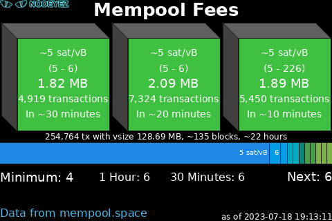

# Mempool Space

This script prepares an image showing statistics about upcoming blocks in the
mempool.  Information about the size of the block, number of transactions, and
fee ranges are provided. It's useful to have this information when preparing a
layer 1 transaction to set fees based on your time preference.  It is based on
the appearance of the mempool space viewer at the publicly accessible
[mempool.space](https://mempool.space) website.  If you have your own MyNodeBTC
instance, or another popular node package running mempool service locally, you
can configure that instance instead for more privacy.  



## Script Location

The script is installed at 
[~/nodeyez/scripts/mempoolspace.py](../scripts/mempoolspace.py).

## Configuration

To manage and configure this script, use the nodeyez-config tool

```sh
sudo nodeyez-config
```

To manually configure this script, edit the `~/nodeyez/config/mempoolspace.json` file

Fields are defined below

| field name | description |
| --- | --- |
| attributionColor | The text color for the source attribution line expressed as a Hexadecimal color specifier. Default `#4cbae6 |
| backgroundColor | The background color of the image expressed as a hexadecimal color specifier. Default `#000000` |
| blockEdgeColor | The color to use for the outline of block shapes expressed as a Hexadecimal color specifier. Default `#202020` |
| blockFaceColor | The color to use for the unfilled portion of the block face expressed as a Hexadecimal color specifier. Default `#606060` |
| blockSatRangeColors | A array of one or more block sat level definitions to influence block color rendering by median sat/vB. The structure of a blockSatRangeColors definition is defined below. |
| blockSideColor | The color to use for the side of the block expressed as a Hexadecimal color specifier. Default `#404040` |
| blockTopColor | The color to use for the top of the block expressed as a Hexadecimal color specifier. Default `#606060` |
| feeHistogramUrl | The url for the mempool fee histogram data. If you are running your own mempool.space service on MyNodeBTC, then use http://127.0.0.1:4080/api/mempool. Default `https://mempool.space/api/mempool` |
| feeRecommendationsUrl | The url for the mempool fees recommendation. If you are running your own mempool.space service on MyNodeBTC, then use http://127.0.0.1:4080/api/v1/fees/recommended. Default `https://mempool.space/api/v1/fees/recommended` |
| height | The height, in pixels, to generate the image. Default `320` |
| histogramSatRangeColors | An array of one or more histogram sat level definitions to show fee level histogram by sat/vB of transactions in the mempool. The structure is defined below. |
| interval | The amount of time, in seconds, the script should wait before data gathering and image creation again. Default `300` |
| mempoolBlocksUrl | The url for the mempool blocks information. If you are running your own mempool.space service on MyNodeBTC, then use http://127.0.0.1:4080/api/v1/fees/mempool-blocks. Default `https://mempool.space/api/v1/fees/mempool-blocks` |
| renderDirection | The direction to render the image. Supported values are: lefttoright, righttoleft. Default `righttoleft` |
| renderMaximumBlocks | The maximum number (1-6) of upcoming blocks to render which will influence the size of the blocks drawn. Default `3` |
| textColor | The color of the text expressed as a Hexadecimal color specifier. Default `#ffffff` |
| useTor | Indicates whether remote calls should use tor socks proxy for privacy. Default `true` |
| width | The width, in pixels, to generate the image. Default `480` |

__blockSatRangeColors__

| field name | description |
| --- | --- |
| satMin | The minimum sat/vbyte value to apply this colorset |
| satMax | The maximum sat/vbyte value to apply this colorset |
| blockColor | The color to use for the face of the block when the sat/vbyte is within range of satMin-satMax |
| textColor | The color to use for the text of the block when the sat/vbyte is within range of satMin-satMax |

Default definition based on mempool.space

```json
blockSatColorRanges = [
  {"satMin": 0.0, "satMax": 10.0, "blockColor": "#40c040", "textColor": "#ffffff"},
  {"satMin": 10.0, "satMax": 30.0, "blockColor": "#9ea90b", "textColor": "#ffffff"},
  {"satMin": 30.0, "satMax": 60.0, "blockColor": "#d1ac08", "textColor": "#ffffff"},
  {"satMin": 60.0, "satMax": 100.0, "blockColor": "#f4511e", "textColor": "#ffffff"},
  {"satMin": 100.0, "satMax": 150.0, "blockColor": "#b71c1c", "textColor": "#ffffff"},
  {"satMin": 150.0, "satMax": 9999.0, "blockColor": "#4a148c", "textColor": "#ffffff"}
]
```

__histogramSatLevels__

| field name | description |
| --- | --- |
| satMin | The minimum sat/vbyte value to apply this colorset |
| satMax | The maximum sat/vbyte value to apply this colorset |
| fillColor | The color to use for the graph portion when the sat/vbyte is within range of satMin-satMax |

Default definition based on mempool.space

```json
histogramSatLevels: [
  {"satMin": 0.0, "satMax": 2.0, "fillColor": "#d81b60"},
  {"satMin": 2.0, "satMax": 3.0, "fillColor": "#8e24aa"},
  {"satMin": 3.0, "satMax": 4.0, "fillColor": "#5e35b1"},
  {"satMin": 4.0, "satMax": 5.0, "fillColor": "#3949ab"},
  {"satMin": 5.0, "satMax": 6.0, "fillColor": "#1e88e5"},
  {"satMin": 6.0, "satMax": 8.0, "fillColor": "#039be5"},
  {"satMin": 8.0, "satMax": 10.0, "fillColor": "#00acc1"},
  {"satMin": 10.0, "satMax": 12.0, "fillColor": "#00897b"},
  {"satMin": 12.0, "satMax": 15.0, "fillColor": "#43a047"},
  {"satMin": 15.0, "satMax": 20.0, "fillColor": "#7cb342"},
  {"satMin": 20.0, "satMax": 30.0, "fillColor": "#c0ca33"},
  {"satMin": 30.0, "satMax": 40.0, "fillColor": "#fdd835"},
  {"satMin": 40.0, "satMax": 50.0, "fillColor": "#ffb300"},
  {"satMin": 50.0, "satMax": 60.0, "fillColor": "#fb8c00"},
  {"satMin": 60.0, "satMax": 70.0, "fillColor": "#f4511e"},
  {"satMin": 70.0, "satMax": 80.0, "fillColor": "#6d4c41"},
  {"satMin": 80.0, "satMax": 90.0, "fillColor": "#757575"},
  {"satMin": 90.0, "satMax": 100.0, "fillColor": "#546e7a"},
  {"satMin": 100.0, "satMax": 125.0, "fillColor": "#b71c1c"},
  {"satMin": 125.0, "satMax": 150.0, "fillColor": "#880e4f"},
  {"satMin": 150.0, "satMax": 9999.0, "fillColor": "#4a148c"}
]
```

## Run Directly

Ensure the virtual environment is activated
```shell
source ~/.pyenv/nodeyez/bin/activate
```

Change to the scripts folder
```shell
cd ~/nodeyez/scripts
```

Run it
```shell
python mempoolspace.py
```

Press CTRL+C to stop the process

## Run at Startup

To enable the script to run at startup, as the privileged user run the following

```shell
sudo systemctl enable nodeyez-mempoolspace.service

sudo systemctl start nodeyez-mempoolspace.service
```

---

[Home](../) | 