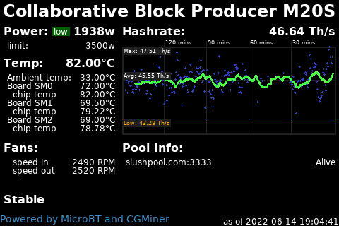

# Miner - MicroBT

This script is useful if you have one or more Bitcoin miners running CGMiner
on a MicroBT Whatsminer.  It prepares an image showing the power, temperature,
fan and pool info along with a graph of the hashrate produced overtime with
moving average and warning thresholds.  It was created with a Whatsminer M20S,
and the hope is to improve for other miners over time.

From API port 4028 on the miner it uses the data from pools+summary+devs



## Script Location

The script is installed at 
[/home/nodeyez/nodeyez/scripts/minermicrobt.py](../scripts/minermicrobt.py).

## Configuration

To configure this script override the default configuration as follows

```shell
nano /home/nodeyez/nodeyez/config/minermicrobt.json
```

You must set the address for the miner

| field name | description |
| --- | --- |
| outputFile | The path to save the generated image. Default `/home/nodeyez/nodeyez/imageoutput/minermicrobt.png` |
| colorTextFG | The color of the text expressed as a Hexadecimal color specifier. Default `#ffffff` |
| colorBackground | The background color of the image expressed as a hexadecimal color specifier. Default `#000000` |
| width | The width, in pixels, to generate the image. Default `480` |
| height | The height, in pixels, to generate the image. Default `320` |
| sleepInterval | The amount of time, in seconds, the script should wait before data gathering and image creation again. Default `60` |
| dataDirectory | The base path for the directory to store hashrate history. Default `/home/nodeyez/nodeyez/data/` |
| colorHot | The color to show the temperature exceeding the hot threshold expressed as a Hexadecimal color specifier. Default `#ffaa00` |
| colorDangerous | The color to show the temperature exceeding the dangerous threshold expressed as a Hexadecimal color specifier. Default `#ff0000` |
| colorHashrateBox | The color of the border, average line and label backgrounds for the hashrate graph expressed as a Hexadecimal color specifier. Default `#202020` |
| colorHashratePlot | The color to plot each hashrate value within the hashrate graph expressed as a Hexadecimal color specifier. Default `#2f3fc5` |
| colorHashrateMA | The color to draw the hashrate moving average line expressed as a Hexadecimal color specifier. Default `#40ff40` |
| colorLowPowerMode | The color to draw the label background indicating if running in low power mode expressed as a Hexadecimal color specifier. Default `#006000` |
| miners | An array of one or more miners. The structure of a miner is defined below |

__miner__

| field name | description |
| --- | --- |
| enabled | Inidicates whether this miner configuration is enabled for monitoring |
| minerlabel | A unique label to give this miner. If provided, it is used as the label in the header area of the image |
| mineraddress | *required* The ip or host address for your miner on your local lan, accessible from the host running the script |
| expectations | An optional structure defining expectations to monitor for. A setting out of range will cause a warning to be rendered. The structure is defined below |


__expectations__

| field name | description |
| --- | --- |
| power | An optional structure defining power expectations to monitor for. This structure is defined below |
| hashrate | An optional structure defining hashrate expectations to monitor for. This structure is defined below |
| pools | An optional structure defining pool definitions of expected pools to send hashrate to. This structure is defined below |
| fans | An optional structure defining fan speed thresholds. This structure is defined below |
| temps | An optional structure defining temp maximums. This structure is defined below |

__power__

| field name | description |
| --- | --- |
| low | An optional property to define the low end of expected power range, in watts. |
| high | An optional property to define the high end of expected power range, in watts. |
| lowmodelow | An optional property to define the low end of expected power usage, in watts, when running in low power mode. |

__hashrate__

| field name | description |
| --- | --- |
| low | An optional property to define the low end of expected hashrate, in MH/s |
| lowmodelow | An optional property to define the low end of expected hashrate, in MH/s, when running in low power mode. |

__pools__

| field name | description |
| --- | --- |
| url | The url for a pool that is expected to be configured |
| user | The user for a pool that is expected to be configured in username.worker format |

__temps__

| field name | description |
| --- | --- |
| maxenv | An optional property to define the maximum allowed ambient temperature range, in degrees celsius. Default 40.00 |
| maxboard | An optional property to define the maximum allowed board temperature range, in degrees celsius. Default 85.00 |
| maxchip | An optional property to define the maximum allowed chip temperature range, in degrees celsius. Default 95.00 |

__fans__

| field name | description |
| --- | --- |
| low | An optional property to define the low end of expected fan speed, in RPMs. |
| high | An optional property to define the high end of expected fan speed, in RPMs. |


After making changes, Save (CTRL+O) and Exit (CTRL+X) nano.

## Run Directly

To run this script

```shell
cd /home/nodeyez/nodeyez/scripts
/usr/bin/env python3 minermicrobt.py
```

Press CTRL+C to stop the process

## Run at Startup

To enable the script to run at startup, as the privileged user run the following

```shell
sudo systemctl enable nodeyez-minermicrobt.service
sudo systemctl start nodeyez-minermicrobt.service
```


---

[Home](../) |

