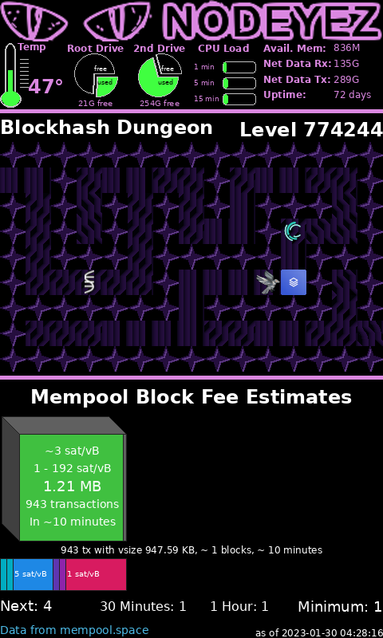

# Two Image Display

This script builds a composite image from images retrieved and stacks them up
for a portrait oriented display.  You can reference images created by your
nodeyez implementation from other services, as well as remote resources on the
internet.  Images will be scaled to the overall image width and stacked from
the bottom up.



## Script Location

This script is installed at
[/home/nodeyez/nodeyez/scripts/nodeyezdual.py](../scripts/nodeyezdual.py).

## Configuration

To configure this script override the default configuration as follows

```sh
nano /home/nodeyez/nodeyez/config/nodeyezdual.json
```

| field name | description |
| --- | --- |
| outputFile | The path to save the generated image. Default `/home/nodeyez/nodeyez/imageoutput/nodeyezdual.png` |
| colorBackground | The background color of the image expressed as a hexadecimal color specifier. Default `#000000` |
| width | The width, in pixels, to generate the image. Default `480` |
| height | The height, in pixels, to generate the image. Default `800` |
| sleepInterval | The amount of time, in seconds, the script should wait before data gathering and image creation again. Default `30` |
| useTor | Indicates whether remote calls should use torify for privacy. Experimental. Default `true` |
| headerSVG | URL to a scalable vector graphic to use as the header. Defaults to the Nodeyez logo |
| topImages | list of URLs to randomly pick from for the top image |
| bottomImages | list of URLs to randomly pick from for the bottom image |
| dividerHeight | The height of an optional divider bar between images. Use 0 for no divider bar. Default 10 |
| dividerBuffer | The height of optiona buffer between images and the divider bar. Use 0 for no buffer. Default 5 |

After making changes, Save (CTRL+O) and Exit (CTRL+X) nano.

## Run Directly

To run this script

```shell
cd /home/nodeyez/nodeyez/scripts
/usr/bin/env python3 nodeyezdual.py
```

Press CTRL+C to stop the process

## Run at Startup

To enable the script to run at startup, as the privileged user run the following

```shell
sudo systemctl enable nodeyez-nodeyezdual.service
sudo systemctl start nodeyez-nodeyezdual.service
```

---

[Home](../) | 
