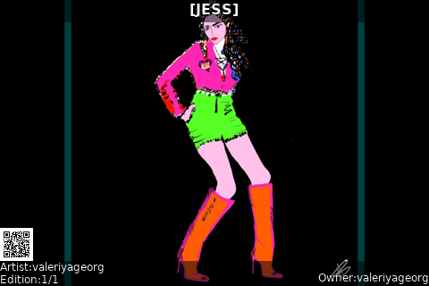

# Raretoshi

This script provides for a local rendering of NFTs posted to [Raretoshi](https://raretoshi.com/market)
with overlays showing the title of the work, author, edition and owner info.
Files downloaded are stored locally as a pseudo IPFS cache to conserve bandwidth.
Only static PNG and JPEG files are supported at this time.



## Script Location

The script is installed at
[~/nodeyez/scripts/raretoshi.py](../scripts/raretoshi.py).

## Configuration

To manage and configure this script, use the nodeyez-config tool

```sh
sudo nodeyez-config
```

To manually configure this script, edit the `~/nodeyez/config/raretoshi.json` file

Fields are defined below

| field name | description |
| --- | --- |
| backgroundColor | The background color of the image expressed as a hexadecimal color specifier. Default `#000000` |
| height | The height, in pixels, to generate the image. Default `320` |
| interval | The amount of time, in seconds, the script should wait before data gathering and image creation again. Default `30` |
| overlayBackgroundColor | If overlayEnabled is true, this is the color of the annotation text background overlay expressed as a Hexadecimal color specifier. Default `#00000080` |
| overlayEnabled | Indicates whether annotations should be labeled over the image to display the title, author, edition and owner information. Default `true` |
| overlayTextColor | If overlayTextEnabled is true, this is the color of the annotation text expressed as a Hexadecimal color specifier. Default `#ffffff` |
| qrCodeEnabled | Indicates whether to show a QR code to link from the image to the raretoshi website for that item. Dfeault `true` |
| qrCodePixelSize | If qrCodeEnabled is true, then this indicates the qr code box size for each pixel. Default `2` |
| randomUserEnabled | Indicates whether to traverse random users based upon discovery through holdings and favorites. Default `true` |
| randomUserInterval | If randomUserEnabled is true, then this is the amount of time, in seconds, before switching to a random user. Default `300` |
| raretoshiUser | The name of the raretoshi user to use in selecting images from their collection. This value is case-sensitive. Default `Bitsi` |
| stretchEdgeEnabled | Indicates whether the edge of the image should be stretched horizontally or vertically to fill the background if the ratio of the source image differs from the generated image. Default `true` |
| stretchEdgeSpacing | If stretchEdgeEnabled is true, then this is the amount of space to skip in the resized image between the source material, and edge being stretched in pixels. Default `30` |
| useTor | Indicates whether remote calls should use tor socks proxy for privacy. Default `true` |
| userInfoInterval | The amount of time, in seconds, the script should wait before refreshing the user information from raretoshi. Default `3600` |
| width | The width, in pixels, to generate the image. Default `480` |

## Run Directly

Ensure the virtual environment is activated
```shell
source ~/.pyenv/nodeyez/bin/activate
```

Change to the scripts folder
```shell
cd ~/nodeyez/scripts
```

Run it
```shell
python raretoshi.py
```

Press CTRL+C to stop the process

## Run at Startup

To enable the script to run at startup, as the privileged user run the following

```shell
sudo systemctl enable nodeyez-raretoshi.service

sudo systemctl start nodeyez-raretoshi.service
```

---

[Home](../) | 