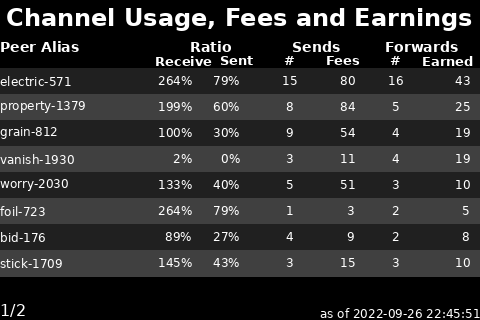

# 
Display panels to get the most from your node

## Channel Fees

This script prepares an image depicting your node's lightning channel routing
velocity and earned fees.  This is initially a basic table listing and will
likely evolve in the future.  Multiple images may be created depending on the
number of open channels.  The script is installed at [/home/nodeyez/nodeyez/scripts/channelfees.py](../scripts/channelfees.py).
It depends on a lighting node.




* To run this script

   ```sh
   cd /home/nodeyez/nodeyez/scripts
   /usr/bin/env python3 channelfees.py
   ```

   Press CTRL+C to stop the process

* To configure this script

   Override the default configuration as follows

   ```sh
   nano /home/nodeyez/nodeyez/config/channelfees.json
   ```

   | field name | description |
   | --- | --- |
   | outputFile | The path to save the generated image. Default `/home/nodeyez/nodeyez/imageoutput/channelfees.png` |
   | colorTextFG | The color of the text expressed as a Hexadecimal color specifier. Default `#ffffff` |
   | colorNodeOffline | The color of the text for an offline node expressed as a Hexadecimal color specifier. Default `#ffa500` |
   | colorNodeDead | The color of the text for a node that has been offline for 1008 blocks expressed as a Hexadecimal color specifier. Default `#ff0000` |
   | colorBackground | The background color of the image expressed as a hexadecimal color specifier. Default `#000000` |
   | colorRowBG1 | The primary color to use as the background for data rows expressed as a Hexadecimal color specifier. Default `#404040` |
   | colorRowBG2 | The alternate color to use as the background for data rows expressed as a Hexadecimal color specifier. Default `#202020` |
   | colorRowFG1 | The color of the text for data rows on primary color background expressed as a Hexadecimal color specifier. Default `#ffffff` |
   | colorRowFG2 | The color of the text for data rows on alternate color background expressed as a Hexadecimal color specifier. Default `#ffffff` |
   | width | The width, in pixels, to generate the image. Default `480` |
   | height | The height, in pixels, to generate the image. Default `320` |
   | sleepInterval | The amount of time, in seconds, the script should wait before data gathering and image creation again. Default `1800` |
   | pageSize | The number of channels to represent per page rendered. Default `8` |
   | headerText | The text to use in the header area. Default `Lightning Channel Balances` |
   | nodes | An array collection of defined nodes to have channel balances reported via rest calls. If this is not provided, then the RPC calls will be made using $
   __nodes__

   | field name | description |
   | --- | --- |
   | enabled | Inidicates whether this node definition is enabled for reporting. If set to false, it will be skipped. |
   | address | The address or hostname for this node. It must be reachable from the server running the script. |
   | port | The port for which the target node is listening for REST based calls. This is the port referenced in the restlisten setting in bitcoin.conf. |
   | useTor | Indicates whether calls to the target node should be made over tor. For internal addresses, this should be set to false. |
   | macaroon | The macaroon to use when communicating with the node in hex format. Requires permissions for uri:/lnrpc.Lightning/GetInfo uri:/lnrpc.Lightning/GetNodeInfo uri:/lnrpc.Lightning/ListChannels uri:/lnrpc.Lightning/ChannelBalance uri:/lnrpc.Lightning/ForwardingHistory uri:/lnrpc.Lightning/ListPayments. If you were using nodeyez on the target node you may use its nodeyez.macaroon created for that node. To get the hex value, you may use the command: `xxd -ps -u -c 1000 nodeyez.macaroon` |
   | __optional__ | __these fields are optional to override the settings above__ |
   | outputFile | Override the path to save the generated image. |
   | colorTextFG | Override the color of the text expressed as a Hexadecimal color specifier. |
   | colorNodeOffline | Override the color of the text for an offline node expressed as a Hexadecimal color specifier. |
   | colorNodeDead | Override the color of the text for a node that has been offline for 1008 blocks expressed as a Hexadecimal color specifier. |
   | colorBackground | Override the background color of the image expressed as a hexadecimal color specifier. |
   | colorBarOutline | Override the color of the outline for the channel balance bar expressed as a hexadecimal color specifier. |
   | colorBarFilled | Override the color of the filled portion representing the local balance of the channel expressed as a hexadecimal color specifier. |
   | colorBarEmpty | Override the color of the unfilled portion representing the remote balance of the channel expressed as a hexadecimal color specifier. |
   | displayBalances | Indicates whether local and remote channel balance amounts should be rendered along with proportional bar. |
   | width | Override the width, in pixels, to generate the image. |
   | height | Override the height, in pixels, to generate the image. |
   | pageSize | Override the number of channels to represent per page rendered. |
   | headerText | Override the text to use in the header area. |

   After making changes, Save (CTRL+O) and Exit (CTRL+X) nano.

---

[Home](../README.md) | 

