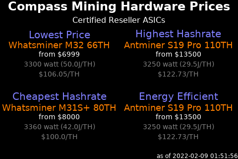

# 
Display panels to get the most from your node

## Compass Mining Hardware

This script creates an image focusing on the lowest priced, highest hashrate,
cheapest hashrate, and efficient hashrate machines currently for sale in the
Compass Mining reseller marketplace.

The script is installed at [/home/nodeyez/nodeyez/scripts/compassmininghardware.py](../scripts/compassmininghardware.py).




* To run this script

   ```sh
   cd /home/nodeyez/nodeyez/scripts
   /home/nodeyez/nodeyez/scripts/compassmininghardware.py
   ```

   Press CTRL+C to stop the process

* To configure this script

   Override the default configuration as follows

   ```sh
   nano /home/nodeyez/nodeyez/config/compassmininghardware.json
   ```

   | field name | description |
   | --- | --- |
   | outputFile | The path to save the generated image. Default `/home/nodeyez/nodeyez/imageoutput/compassmininghardware.png` |
   | hardwareurl | The url that provides current compass mining hardware prices for featured, reseller, and at home ASICs. Default `https://us-central1-hashr8-compass.cloudfunctions.net/app/hardware/group?isWeb=true&sortByCost=asc` |
   | useTor | Indicates whether remote calls should use torify for privacy. Experimental. Default `true` |
   | colorTextFG | The color of the text expressed as a Hexadecimal color specifier. Default `#ffffff` |
   | colorTextWarn | The color of the text if there are warnings or errors accessing the hardwareurl. Default `#ff0000` |
   | colorBackground | The background color of the image expressed as a hexadecimal color specifier. Default `#000000` |
   | colorEntryLabel | The color of the group/category label expressed as a Hexadecimal color specifier. Default `#8080ff` |
   | colorEntryName | The color of the miner name expressed as a Hexadecimal color specifier. Default `#ff8000` |
   | colorEntryPrice | The color of the price expressed as a Hexadecimal color specifier. Default `#ffffff` |
   | colorEntryPower | The color of the power info text expressed as a Hexadecimal color specifier". Default `#808080` |
   | sizeEntryLabel | The font size to use for the group/category label. Default `20` |
   | sizeEntryName | The font size to use for the miner name. Default `18` |
   | sizeEntryInfo | The font size to use for the informational labels. Default `14` |
   | width | The width, in pixels, to generate the image. Default `480` |
   | height | The height, in pixels, to generate the image. Default `320` |
   | sleepInterval | The amount of time, in seconds, the script should wait before data gathering and image creation again. Default `3600` |

   After making changes, Save (CTRL+O) and Exit (CTRL+X) nano.

---

[Home](../README.md) | 

