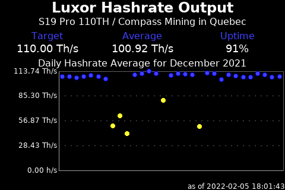

# 
Display panels to get the most from your node

## Luxor Mining Hashrate

This script prepares images for each month of hashrate data available for your
Luxor Tech mining pool account.  The script is installed at
[/home/nodeyez/nodeyez/scripts/luxor-mining-hashrate.py](../scripts/luxor-mining-hashrate.py).



Status: Beta. 

See also the [/home/nodeyez/nodeyez/scripts/daily-data-retrieval.py](../scripts/daily-data-retrieval.py)
script and [documentation](./script-daily-data-retrieval.md) which retrieves the
same information but doesn't produce the images. In time this script will be
updated to use that common data.

At time of writing, this script uses a modified version of the 
[Luxor Python Client](https://github.com/LuxorLabs/graphql-python-client). The
files (luxor.py and resolvers.py) are already copied into this repo so no 
additional action is required. A Pull Request has been opened with the upstream
repository to include the change (forced sort order for the data). This PR
has recently been merged and other enhancements have been made to the client
that have not yet been brought into this project yet.  The Luxor Python client
uses Pandas, which needs to be installed once if you haven't yet done so.

* To run this script

   ```sh
   cd /home/nodeyez/nodeyez/scripts
   ./luxor-mining-hashrate.py
   ```

   Press CTRL+C to stop the process

* To configure this script

   Override the default configuration as follows

   ```sh
   nano /home/nodeyez/nodeyez/config/luxor.json
   ```

   - You must have an account with [Luxor](https://beta.luxor.tech/) and an
     API Key for that account. Read only access is sufficient

   | field name | description |
   | --- | --- |
   | outputFile | The path to save the generated image. Default `/home/nodeyez/nodeyez/imageoutput/luxor-mining-hashrate.png` |
   | colorTextFG | The color of the text expressed as a Hexadecimal color specifier. Default `#ffffff` |
   | colorBackground | The background color of the image expressed as a hexadecimal color specifier. Default `#000000` |
   | sleepInterval | The amount of time, in seconds, the script should wait before data gathering and image creation again. Default `86400` |
   | apikey | Your api key for your Luxor account. |
   | username | Your username for your Luxor account. |
   | subheadingText | A label beneath the main header useful for identifying the miner. Default `S19 Pro 110TH` |
   | hashrateTarget | The hashrate per second for the expected miner output. Default `110000000000000` |
   | hashrateLowThreshold | The hashrate level for which hashing should be considered low. Default `90000000000000` | 
   | colorDataValue | The color of the text values for major categories expressed as a Hexadecimal color specifier. Default `#4040ff` | 
   | colorHashDotFill | The color to plot a dot for the hashrate when normal at a point in time expressed as a Hexadecimal color specifier. Default `#4040ff` |
   | colorHashDotFillZero | The color to plot a dot for the hashrate when it is zero/unreported at a point in time expressed as a Hexadecimal color specifier. Default `#ff4040` |
   | colorHashDotFillLow | The color to plot a dot for the hashrate when it below the low threshold at a point in time expressed as a Hexadecimal color specifier. Default `#ffff40` |
   | colorHashDotOutline | The color to make the outline of plotted dots for normal hashrate expressed as a Hexadecimal color specifier. Default `#0000ff` |
   | colorHashDotOutlineZero | The color to make the outline of plotted dots for zero/unreported hashrate expressed as a Hexadecimal color specifier. Default `#ff0000` | 
   | colorHashDotOutlineLow | The color to make the outline of plotted dots for low hashrate expressed as a Hexadecimal color specifier. Default `#ffff00` |
   | colorMovingAverage | The color to use for the moving average line expressed as a Hexadecimal color specifier. Default `#40ff40` |
   | colorGraphLineLight | The color to use for the left and bottom borders of the plot graph, expressed as a Hexadecimal color specifier. Default `#a0a0a0` |
   | colorGraphLineDark | The color to use for the right and top borders of the blot graph, expressed as a Hexadecimal color specifier. Default `#606060` |

   After making changes, Save (CTRL+O) and Exit (CTRL+X) nano.


---

[Home](../README.md) | 

