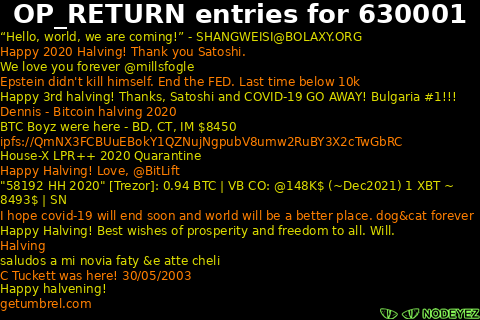

# 
Display panels to get the most from your node

## OP_RETURN

This script calls your local bitcoin node and will look for any OP_RETURN entries
on the current block (or specified block).  If suitable entries are found, an image
will be generated rendering the text values.



* To run this script

   ```sh
   cd /home/nodeyez/nodeyez/scripts
   /home/nodeyez/nodeyez/scripts/opreturn.py
   ```

   Press CTRL+C to stop the process

* To configure this script

   Override the default configuration as follows

   ```sh
   nano /home/nodeyez/nodeyez/config/opreturn.json
   ```

   | field name | description |
   | --- | --- |
   | outputFile | The path to save the generated image. Default `/home/nodeyez/nodeyez/imageoutput/opreturn.png` |
   | colorBackground | The background color of the image expressed as a hexadecimal color specifier. Default `#000000` |
   | width | The width, in pixels, to generate the image. Default `480` |
   | height | The height, in pixels, to generate the image. Default `320` |
   | sleepInterval | The amount of time, in seconds, the script should wait before data gathering and image creation again. Default `30` |
   | colorTextFG | The color to use for the header expressed as a hexadecimal color specifier. Default `#ffffff` |
   | colorTextFG1 | The primary color to use for OP_RETURN text expressed as a hexadecimal color specifier. Default `#ff7f00` |
   | colorTextFG2 | The alternate color to use for OP_RETURN text expressed as a hexadecimal color specifier. Default `#dddd00` |

   After making changes, Save (CTRL+O) and Exit (CTRL+X) nano.


---

[Home](../README.md) | 

