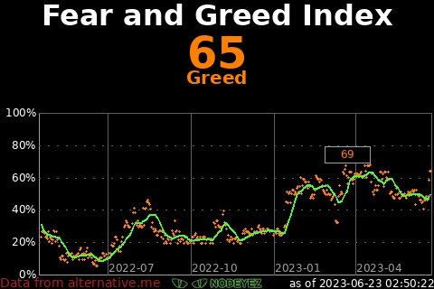
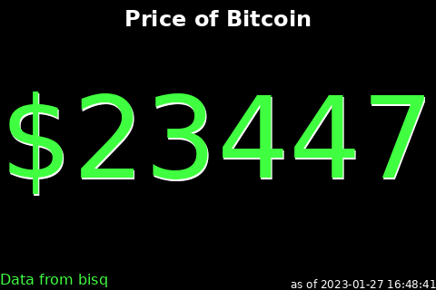
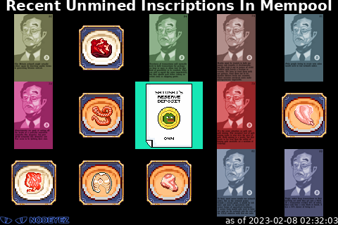
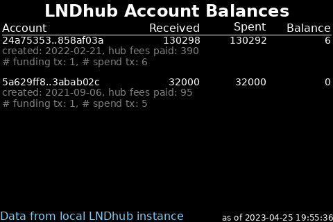
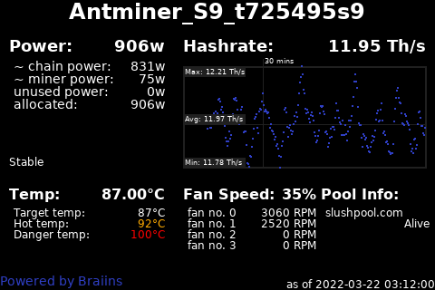
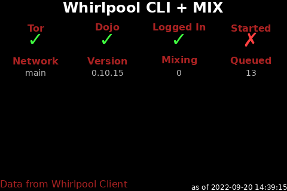
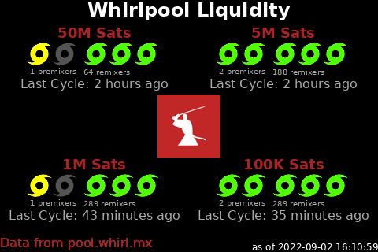

# About Nodeyez

Nodeyez is a project that contains a variety of python [scripts](./scripts) to produce images based on your Bitcoin Node

Images can be displayed
* to video output such as an attached screen on a Raspberry Pi
* in a website dashboard for browser based acess

In addition, some scripts have support for reporting data to a local [Blockclock Mini](https://blockclockmini.com/).

Scripts can be run on their own, or run continuously in the background as a service on system startup.

## Sample Panels Created by Nodeyez

  

  

  

  

  

  

  

  

  

  

  

  

  

  

  

  

  

  

  

  

  

  

  

  

  

  

  <button class="btn btn-next">&gt;</button>
  <button class="btn btn-prev">&lt;</button>

## Informational Panels

* [IP Address](./docs/script-ipaddress.md)
* [System Metrics](./docs/script-sysinfo.md)
* [UTC Clock](./docs/script-utcclock.md)

## Bitcoin Panels

All of these panels can work with a local Bitcoin node. At this time, information is accessed via bitcoin-cli RPC calls.

* [Art Hash](./docs/script-arthash.md)
* [Blockhash Dungeon](./docs/script-arthashdungeon.md)
* [Block Height](./docs/script-blockheight.md)
* [Difficulty Epoch](./docs/script-difficultyepoch.md)
* [Halving Countdown](./docs/script-halving.md)
* [Inscription Mempool](./docs/script-inscriptionmempool.md)
* [Mempool Blocks](./docs/script-mempoolblocks.md)
* [OP_RETURN](./docs/script-opreturn.md)
* [Ordinal Inscriptions](./docs/script-ordinals.md)

## Lighting (LND) Panels

These panels can be configured to report on local LND based nodes, as well as remote ones over REST.

* [Channel Balance](./docs/script-channelbalance.md)
* [Channel Fees](./docs/script-channelfees.md)
* [LND Hub Account Balances](./docs/script-lndhub.md)
* [Ring of Fire](./docs/script-rofstatus.md)

## Mining Panels

* [F2 Pool](./docs/script-f2pool.md)
* [Luxor Pool](./docs/script-luxor-mining-hashrate.md)
* [Miner - Braiins](./docs/script-minerbraiins.md)
* [Miner - MicroBT](./docs/script-minermicrobt.md)
* [Braiins Pool](./docs/script-slushpool.md)

## Other Fun Panels

* [Dual Image Display](./docs/script-nodeyezdual.md)
* [Fear and Greed Index](./docs/script-fearandgreed.md)
* [Price of Bitcoin](./docs/script-fiatprice.md)
* [Sats per USD](./docs/script-satsperusd.md)
* [Whirlpool CLI Mix Status](./docs/script-whirlpoolclimix.md)
* [Whirlpool Liquidity](./docs/script-whirlpoolliquidity.md)

## No Longer Supported

The scripts are still available, but may not properly function as the data providers have changed from open standards or charge exhorbitant fees.

* [Compass Mining Hardware](./docs/script-compassmininghardware.md)
* [Compass Mining Status](./docs/script-compassminingstatus.md)
* [Gas Price](./docs/script-gasprice.md)
* [Raretoshi](./docs/script-raretoshi.md)

# Installation Procedures

## [Raspberry Pi](./docs/install-1-raspberrypinode.md)
## [Python and Dependencies](./docs/install-2-pythondeps.md)
## [Display Screen](./docs/install-3-displayscreen.md)
## [Nodeyez User Setup](./docs/install-4-nodeyez.md)
## [Website Dashboard](./docs/install-5-websitedashboard.md)
## [Running at Startup](./docs/install-6-runatstartup.md)

