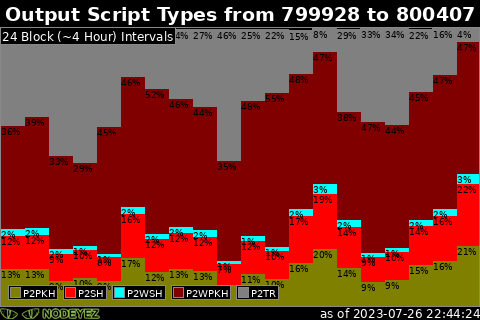
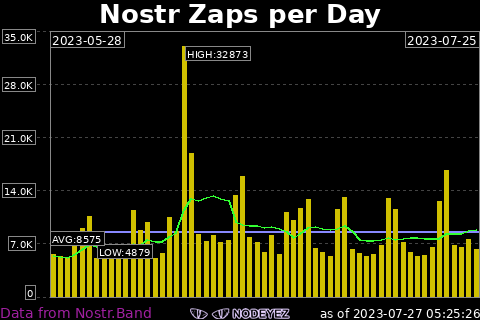

# About Nodeyez 

Nodeyez produces images based on your Bitcoin Node and resources!

View on an attached screen or remotely via Website Dashboard!

To setup Nodeyez, follow the [Quick Start Installation]()!

There are a variety of panel types that you can selectively enable and configure using the [Nodeyez-Config tool]()

## Sample Panels Created by Nodeyez

  

  

  

  

  

  

  

  

  

  

  

  

  

  

  

  

  

  

  

  

  

  

  

  

  

  

  

  

  

  

  

  

  <button class="btn btn-next">&gt;</button>
  <button class="btn btn-prev">&lt;</button>

## Additional Info

Full [Install Steps]() are broken down and explained for each command run.

You can choose which panels you want to run from the [Panel Index]().

Optionally attach a [Display Screen]() and [Run as a Slideshow]().

Want to contribute and make changes? For guidance on setting up a development environment, start with the [Python and IDE Setup]().

[Change Log]()

You can support me by using the Mash Boost button, or sending me tips via [Strike](https://strike.me/vicariousdrama)

