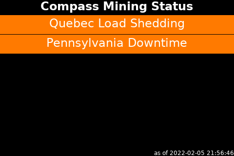

# About Nodeyez

Nodeyez is a project that contains a variety of python [scripts](./scripts) to produce images based on your Bitcoin Node

Scripts can be run on their own, or configured as a background service on system startup.

## Sample Panels Created by Nodeyez

  

  

  

  

  

  

  

  

  

  

  

  

  

  

  

  

  

  

  

  

  

  

  

  

  

  

  

  

  

  <button class="btn btn-next">&gt;</button>
  <button class="btn btn-prev">&lt;</button>

## Install and Configure

To setup Nodeyez, follow the [Install Steps]().

Choose which panels you want to run from the [Panel Index]().

View generated images via website dashboard. 

Optionally attach a [Display Screen]() and [Run as a Slideshow]().

For guidance on setting up a development environment, start with the [Python and IDE Setup]().

[Change Log]()

You can support me by using the Mash Boost button, or sending me tips via [Strike](https://strike.me/vicariousdrama)

