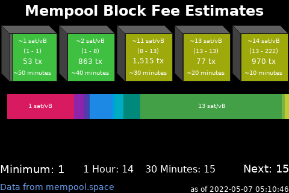

# About Nodeyez

Nodeyez is a project that contains a variety of python [scripts](./scripts) to produce images based on your Bitcoin Node

Images can be displayed
* to video output such as an attached screen on a Raspberry Pi
* in a website dashboard for browser based acess

In addition, some scripts have support for reporting data to a local [Blockclock Mini](https://blockclockmini.com/).

Scripts can be run on their own, or run continuously in the background as a service on system startup.

## Sample Panels Created by Nodeyez

  

  

  

  

  

  

  

  

  

  

  

  

  

  

  

  

  

  

  

  

  

  

  

  

  

  

  <button class="btn btn-next">&gt;</button>
  <button class="btn btn-prev">&lt;</button>

## Informational Panels

* [IP Address]()
* [System Metrics]()
* [UTC Clock]()

## Bitcoin Panels

All of these panels can work with a local Bitcoin node. At this time, information is accessed via bitcoin-cli RPC calls.

* [Art Hash]()
* [Blockhash Dungeon]()
* [Block Height]()
* [Difficulty Epoch]()
* [Halving Countdown]()
* [Inscription Mempool]()
* [Mempool Blocks]()
* [OP_RETURN]()
* [Ordinal Inscriptions]()

## Lighting (LND) Panels

These panels can be configured to report on local LND based nodes, as well as remote ones over REST.

* [Channel Balance]()
* [Channel Fees]()
* [LND Hub Account Balances]()
* [Ring of Fire]()

## Mining Panels

* [F2 Pool]()
* [Luxor Pool]()
* [Miner - Braiins]()
* [Miner - MicroBT]()
* [Braiins Pool]()

## Other Fun Panels

* [Dual Image Display]()
* [Fear and Greed Index]()
* [Price of Bitcoin]()
* [Sats per USD]()
* [Whirlpool CLI Mix Status]()
* [Whirlpool Liquidity]()

## No Longer Supported

The scripts are still available, but may not properly function as the data providers have changed from open standards or charge exhorbitant fees.

* [Compass Mining Hardware]()
* [Compass Mining Status]()
* [Gas Price]()
* [Raretoshi]()

